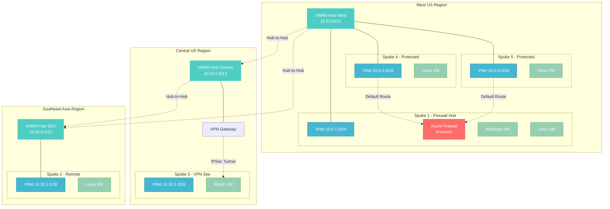
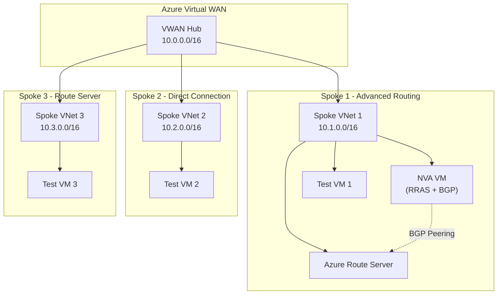

# Azure Virtual WAN Lab Environment

[](https://opensource.org/licenses/MIT)
[](https://azure.microsoft.com/en-us/services/virtual-wan/)
[](https://docs.microsoft.com/en-us/azure/azure-resource-manager/bicep/)
[](https://docs.microsoft.com/en-us/powershell/)
[](https://dotnet.microsoft.com/)

A comprehensive Azure Virtual WAN lab environment demonstrating advanced networking concepts including BGP peering, Azure Route Server integration, Network Virtual Appliances (NVAs), **Azure Firewall Premium**, **multi-region connectivity**, and enterprise-grade automation. Features **multi-region deployment**, **VPN connectivity**, and **intelligent resource management**.

## 🎯 Overview

This lab environment showcases two architecture options:

### **🔥 NEW: Multi-Region Architecture (v2.0)**
- **3 VWAN Hubs** across West US, Central US, and Southeast Asia
- **Azure Firewall Premium** as security hub in West US
- **VPN Site-to-Site** connectivity via RRAS
- **5 Spoke VNets** with specialized routing configurations
- **Cross-region connectivity** and traffic steering

### **Classic Architecture (v1.0)**
- **Single VWAN Hub** with branch-to-branch connectivity
- **Network Virtual Appliances (NVAs)** with RRAS and BGP configuration
- **Azure Route Server** integration for advanced routing scenarios
- **Multi-spoke architecture** demonstrating various connectivity patterns

> **💡 Perfect for**: Network engineers, Azure architects, and DevOps teams learning advanced Azure networking concepts.

## 🌐 Multi-Region Architecture (v2.0)



## 🏗️ Classic Architecture (v1.0)



## 🚀 Quick Start

### Prerequisites

- Azure subscription with appropriate permissions
- [Azure CLI](https://docs.microsoft.com/en-us/cli/azure/install-azure-cli) or [Azure PowerShell](https://docs.microsoft.com/en-us/powershell/azure/install-az-ps)
- [.NET 8 SDK](https://dotnet.microsoft.com/download/dotnet/8.0) (for automation tools)

### 🔥 Multi-Region Lab (v2.0) - RECOMMENDED

```powershell
# Clone the repository
git clone https://github.com/Azure-VWAN-Lab/Azure-VWAN-Lab.git
cd Azure-VWAN-Lab

# Deploy complete multi-region lab with Azure Firewall
.\scripts\Deploy-VwanLab-MultiRegion.ps1 -ResourceGroupName "rg-vwanlab-multiregion"

# OR: Deploy infrastructure only (no VMs)
.\scripts\Deploy-VwanLab-MultiRegion.ps1 -ResourceGroupName "rg-vwanlab-mr" -DeploymentMode InfrastructureOnly

# OR: Deploy specific phase only
.\scripts\Deploy-VwanLab-MultiRegion.ps1 -ResourceGroupName "rg-vwanlab-mr" -Phase 3
```

### 🎯 Classic Lab (v1.0)

```powershell
# Clone the repository
git clone https://github.com/Azure-VWAN-Lab/Azure-VWAN-Lab.git
cd Azure-VWAN-Lab

# Deploy the complete classic lab (standard security)
.\scripts\Deploy-VwanLab.ps1 -ResourceGroupName "rg-vwanlab-classic"

# OR: Deploy with enhanced security (JIT + Auto-Shutdown)
.\scripts\Deploy-VwanLab.ps1 -ResourceGroupName "rg-vwanlab-security" -SfiEnable -EnableAutoShutdown
```

> 💡 **Security Note**: The `-SfiEnable` switch automatically detects your public IP and configures Just-In-Time VM access through Microsoft Defender for Cloud, with NSG fallback if unavailable.

## 📚 Documentation

### 📖 Core Documentation

| Document | Description |
|----------|-------------|
| **[� Multi-Region Architecture](docs/multiregion-architecture.md)** | **NEW**: Comprehensive multi-region VWAN lab with Azure Firewall |
| **[�🏗️ Architecture Guide](docs/architecture.md)** | Classic architecture overview and component relationships |
| **[🚀 Deployment Guide](docs/deployment.md)** | Step-by-step deployment instructions and options |
| **[👤 User Guide](docs/user-guide.md)** | Day-to-day usage and management procedures |
| **[⚙️ Configuration Guide](docs/configuration.md)** | Advanced configuration and customization options |
| **[🔧 Troubleshooting Guide](docs/troubleshooting.md)** | Common issues and resolution steps |
| **[💰 Cost Optimization Guide](docs/cost-optimization-guide.md)** | Cost management and optimization strategies |
| **[🗑️ Cleanup Guide](docs/cleanup-guide.md)** | Resource cleanup and decommissioning procedures |

### 🛠️ Technical Documentation

| Document | Description |
|----------|-------------|
| **[👨‍💻 Developer Guide](docs/developer-guide.md)** | Development workflows and contribution guidelines |
| **[🤖 .NET Automation Guide](docs/dotnet-automation-guide.md)** | Enterprise automation tools and programmatic management |
| **[📊 VM Deployment Analysis](docs/vm-deployment-analysis.md)** | Virtual machine specifications and deployment patterns |
| **[📝 VM Naming Standards](docs/vm-naming-standardization-summary.md)** | Standardized naming conventions and best practices |
| **[🔄 Phased Deployment Strategy](docs/why-phased-deployment.md)** | Understanding the phased deployment approach |
| **[🏥 Boot Diagnostics Implementation](docs/boot-diagnostics-implementation.md)** | VM diagnostics and monitoring setup |

### 📊 Analysis & Updates

| Document | Description |
|----------|-------------|
| **[💵 2025 Cost Analysis Update](docs/2025-cost-analysis-update.md)** | Latest pricing analysis and cost breakdowns |
| **[📈 Cost Update Summary](docs/cost-update-summary.md)** | Summary of recent cost optimizations |
| **[🏷️ Spoke 3 Naming Update](docs/spoke3-naming-update-summary.md)** | Route Server to Spoke 3 renaming summary |
| **[✅ Topology Validation](docs/TOPOLOGY-VALIDATION-COMPLETE.md)** | Complete architecture validation results |

### 🔗 Reference Documentation

| Document | Description |
|----------|-------------|
| **[🧹 Cleanup System](docs/references/CLEANUP-SYSTEM-COMPLETE.md)** | Automated cleanup system implementation |
| **[📋 Consolidation Summary](docs/references/CONSOLIDATION-SUMMARY.md)** | Script and template consolidation overview |
| **[📚 Documentation Updates](docs/references/DOCUMENTATION-UPDATE-SUMMARY.md)** | Documentation maintenance and updates |
| **[⚡ Enhancement Summary](docs/references/ENHANCEMENT-SUMMARY.md)** | Feature enhancements and improvements |
| **[🔒 NSG Security Analysis](docs/references/NSG-SECURITY-ANALYSIS.md)** | Network Security Group configuration analysis |
| **[🛡️ NSG Security Cleanup](docs/references/NSG-SECURITY-CLEANUP-SUMMARY.md)** | Security configuration cleanup summary |
| **[🔄 RRAS Service Fix](docs/references/RRAS-SERVICE-FIX-SUMMARY.md)** | RRAS service configuration and fixes |
| **[🎯 Simplification Summary](docs/references/SIMPLIFICATION-SUMMARY.md)** | Architecture simplification overview |
| **[🔄 VM Redeployment Enhancement](docs/references/VM-REDEPLOYMENT-ENHANCEMENT.md)** | VM deployment improvements |

## 💰 Cost Overview

| Component | Monthly Cost (2025) | Usage |
|-----------|-------------------|-------|
| **VWAN Hub** | ~$184.00 | 24/7 Hub Operations |
| **Route Server** | ~$184.00 | 24/7 BGP Services |
| **4x Virtual Machines** | ~$91.51 | Standard B-Series VMs |
| **Storage & Networking** | ~$15.00 | Managed Disks, Public IPs |
| **Total** | **~$474.51/month** | **$0.65/hour** |

> 💡 **Cost Optimization**: See our [Cost Optimization Guide](docs/cost-optimization-guide.md) for strategies to reduce costs by up to 70% using scheduling and right-sizing.

## 🔐 Security Features (SFI - Secure Future Initiative)

### Just-In-Time (JIT) VM Access

The lab includes advanced security features that automatically configure secure access:

**Automatic IP Detection & JIT Configuration:**
```powershell
# Deploy with JIT enabled - script will:
# 1. Auto-detect your public IP address
# 2. Prompt for confirmation or custom IP entry
# 3. Configure JIT policies via Microsoft Defender for Cloud
# 4. Fall back to restrictive NSG rules if Defender unavailable
.\scripts\Deploy-VwanLab.ps1 -ResourceGroupName "rg-vwanlab-security" -SfiEnable
```

**How JIT Access Works:**
1. **IP Detection**: Script automatically detects your public IP using `(Invoke-RestMethod ipinfo.io/ip)`
2. **User Confirmation**: Prompts: *"Detected IP: X.X.X.X - Use this IP for secure access? (Y/N/Custom)"*
3. **JIT Policy Creation**: Configures Microsoft Defender for Cloud JIT policies for all lab VMs
4. **Fallback Security**: If Defender unavailable, creates restrictive NSG rules as backup
5. **Multi-VM Support**: Applies security configuration to NVA, test, and Route Server VMs

**Auto-Shutdown Integration:**
```powershell
# Combine JIT with auto-shutdown for maximum cost optimization
.\scripts\Deploy-VwanLab.ps1 -ResourceGroupName "rg-vwanlab-optimized" -SfiEnable -EnableAutoShutdown -AutoShutdownTime "18:00"
```

**Security Parameters Quick Reference:**
- `-SfiEnable`: Enable Just-In-Time VM access (Secure Future Initiative)
- `-EnableAutoShutdown`: Enable automatic VM shutdown scheduling
- `-AutoShutdownTime "HH:MM"`: Custom shutdown time (default: "01:00")
- `-AutoShutdownTimeZone "Zone"`: Timezone (default: "Eastern Standard Time")

### Security Architecture

- **🛡️ Microsoft Defender Integration**: Primary JIT access method via Defender for Cloud
- **🔒 NSG Fallback**: Restrictive network security group rules when Defender unavailable  
- **🕐 Auto-Shutdown**: Configurable VM shutdown scheduling (default: 1:00 AM)
- **🌐 IP-Restricted Access**: RDP access limited to deployer IP address only
- **🔑 Secure Credential Management**: Prompts for credentials only when creating new VMs

## 🎯 Key Features

### ✅ **Enterprise-Ready Architecture**
- **Performance-Optimized Deployment** - Uses Standard_B2s VMs with 2GB RAM for reliable operations
- **Phased Deployment Strategy** - Timeout-resistant approach ensuring reliable provisioning
- **Zero Trust Network Security** - VirtualNetwork-scoped NSG rules with minimal access
- **Boot Diagnostics Enabled** - Comprehensive VM monitoring and troubleshooting

### ✅ **Security Features (SFI - Secure Future Initiative)**
- **Just-In-Time (JIT) VM Access** - Automatic IP detection and JIT policy configuration
- **Deployer IP Auto-Detection** - Discovers your public IP and prompts for confirmation
- **Microsoft Defender Integration** - Uses Defender for Cloud for JIT access policies
- **NSG Fallback Security** - Restrictive NSG rules when JIT is unavailable
- **Auto-Shutdown Scheduling** - Cost-optimized VM shutdown at 1:00 AM (configurable)
- **Secure RDP Access** - IP-restricted access with automatic firewall configuration

### ✅ **Advanced Networking Features**
- **BGP Peering** - Automated RRAS configuration with BGP support
- **Azure Route Server Integration** - Advanced routing scenario demonstrations
- **Multi-Spoke Architecture** - Various connectivity patterns and use cases
- **Network Virtual Appliances** - Windows Server 2022 with RRAS routing

### ✅ **Automation & Management**
- **.NET 8 Automation Suite** - Professional-grade programmatic management
- **Intelligent Resource Management** - Dependency-aware cleanup and provisioning
- **Real-time Monitoring** - Continuous health checks and performance metrics
- **CI/CD Integration** - Built for automated pipelines and enterprise workflows

### ✅ **Developer Experience**
- **Bicep Infrastructure as Code** - Modern ARM template alternative
- **PowerShell Automation** - Comprehensive deployment and management scripts
- **Comprehensive Documentation** - Detailed guides for all scenarios
- **Extensible Architecture** - Easy to modify and extend for custom scenarios

## 🛠️ Repository Structure

```
├── 📁 bicep/                          # Infrastructure as Code
│   ├── main.bicep                     # Main deployment template
│   ├── 📁 modules/                    # Reusable Bicep modules
│   ├── 📁 parameters/                 # Parameter files
│   └── 📁 phases/                     # Phased deployment templates
├── 📁 scripts/                        # PowerShell automation scripts
│   ├── Deploy-VwanLab.ps1            # Main deployment script
│   ├── Configure-NvaVm.ps1           # NVA configuration
│   └── Test-Connectivity.ps1         # Connectivity testing
├── 📁 src/                            # .NET automation tools
│   └── VwanLabAutomation/             # Enterprise management suite
├── 📁 docs/                           # Comprehensive documentation
│   ├── 📁 references/                 # Technical reference materials
│   └── *.md                          # User and technical guides
├── 📁 arm-templates/                  # ARM template compatibility
└── 📁 archive/                        # Legacy components
```

## 🚀 Deployment Options

### Option 1: Complete Lab (Recommended)
```powershell
.\scripts\Deploy-VwanLab.ps1 -ResourceGroupName "rg-vwanlab-demo"
```

### Option 2: Secure Lab with JIT Access (SFI)
```powershell
# Deploy with Just-In-Time VM access and auto-shutdown
.\scripts\Deploy-VwanLab.ps1 -ResourceGroupName "rg-vwanlab-security" -SfiEnable -EnableAutoShutdown
```

### Option 3: Infrastructure Only
```powershell
.\scripts\Deploy-VwanLab.ps1 -ResourceGroupName "rg-vwanlab-demo" -DeploymentMode InfrastructureOnly
```

### Option 4: Phased Deployment
```powershell
# Deploy infrastructure first
.\scripts\Deploy-VwanLab.ps1 -ResourceGroupName "rg-vwanlab-demo" -Phase 1

# Add VMs
.\scripts\Deploy-VwanLab.ps1 -ResourceGroupName "rg-vwanlab-demo" -Phase 2
```

### Option 5: .NET Automation Tools
```bash
# Build and run automation suite
dotnet run --project .\src\VwanLabAutomation\ -- status --resource-group "rg-vwanlab-demo"
```

## 🔧 Management Tasks

### Common Operations

```powershell
# Check lab status
.\scripts\Get-LabStatus.ps1 -ResourceGroupName "rg-vwanlab-demo"

# Test connectivity
.\scripts\Test-Connectivity.ps1 -ResourceGroupName "rg-vwanlab-demo"

# Configure BGP peering
.\scripts\Configure-NvaBgp.ps1 -ResourceGroupName "rg-vwanlab-demo"

# Cleanup resources
.\scripts\Cleanup-ResourceGroups.ps1 -ResourceGroupName "rg-vwanlab-demo"
```

### Security Management (SFI)

```powershell
# Configure JIT access for existing VMs
.\scripts\Set-VmJitAccess.ps1 -ResourceGroupName "rg-vwanlab-demo"

# Configure auto-shutdown with custom time
.\scripts\Set-VmAutoShutdown.ps1 -ResourceGroupName "rg-vwanlab-demo" -AutoShutdownTime "18:00"

# Deploy with enhanced security features
.\scripts\Deploy-VwanLab.ps1 -ResourceGroupName "rg-vwanlab-security" -SfiEnable -EnableAutoShutdown -AutoShutdownTime "22:00"
```

### Enterprise Automation

```bash
# Real-time monitoring
dotnet run --project .\src\VwanLabAutomation\ -- monitor --resource-group "rg-vwanlab-demo"

# Automated testing
dotnet run --project .\src\VwanLabAutomation\ -- test --resource-group "rg-vwanlab-demo"

# Intelligent cleanup
dotnet run --project .\src\VwanLabAutomation\ -- cleanup --resource-group "rg-vwanlab-demo"
```

## 🤝 Contributing

We welcome contributions! Please see our [Developer Guide](docs/developer-guide.md) for:
- Development setup and workflows
- Coding standards and best practices
- Pull request guidelines
- Testing procedures

## 📝 License

This project is licensed under the MIT License - see the [LICENSE](LICENSE) file for details.

## 🆘 Support

- **📖 Documentation**: Check our comprehensive [documentation](docs/) for detailed guides
- **🐛 Issues**: Report bugs and request features via [GitHub Issues](https://github.com/shahankarim_microsoft/LAB-AZ-VWAN-SPOKEX/issues)
- **💬 Discussions**: Join conversations in [GitHub Discussions](https://github.com/shahankarim_microsoft/LAB-AZ-VWAN-SPOKEX/discussions)
- **🔧 Troubleshooting**: See our [Troubleshooting Guide](docs/troubleshooting.md)

## 🏷️ Tags

`azure` `virtual-wan` `networking` `bicep` `powershell` `automation` `bgp` `route-server` `nva` `infrastructure-as-code` `lab-environment` `enterprise` `devops` `cloud-native`

---

**⭐ Star this repository** if you find it helpful for learning Azure Virtual WAN concepts!

**🍴 Fork this repository** to customize it for your specific networking scenarios!

---
*Made with ❤️ by the Azure Networking Community*