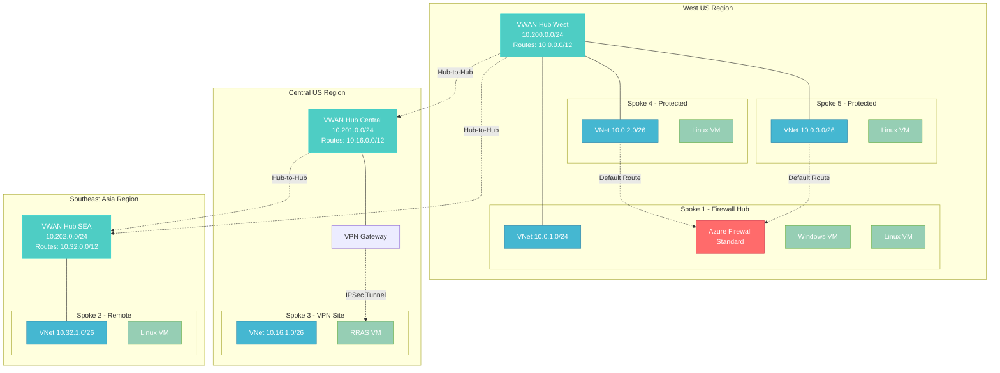

# Azure Virtual WAN Lab Environment

[](https://opensource.org/licenses/MIT)
[](https://azure.microsoft.com/en-us/services/virtual-wan/)
[](https://docs.microsoft.com/en-us/azure/azure-resource-manager/bicep/)
[](https://docs.microsoft.com/en-us/powershell/)
[](https://dotnet.microsoft.com/)

A comprehensive Azure Virtual WAN lab environment demonstrating advanced networking concepts including BGP peering, Azure Route Server integration, Network Virtual Appliances (NVAs), **Azure Firewall Standard**, **multi-region connectivity**, and enterprise-grade automation. Features **multi-region deployment**, **VPN connectivity**, **Just-In-Time (JIT) VM access**, and **intelligent resource management**.

## 🎯 Overview

This lab environment showcases two architecture options:

### **🔥 NEW: Multi-Region Architecture (v2.0)**
- **3 VWAN Hubs** across West US, Central US, and Southeast Asia
- **Azure Firewall Standard** as security hub in West US
- **VPN Site-to-Site** connectivity via RRAS
- **5 Spoke VNets** with specialized routing configurations
- **Cross-region connectivity** and traffic steering
- **Just-In-Time (JIT) VM access** with automated security configuration

### **Classic Architecture (v1.0)**
- **Single VWAN Hub** with branch-to-branch connectivity
- **Network Virtual Appliances (NVAs)** with RRAS and BGP configuration
- **Azure Route Server** integration for advanced routing scenarios
- **Multi-spoke architecture** demonstrating various connectivity patterns

> **💡 Perfect for**: Network engineers, Azure architects, and DevOps teams learning advanced Azure networking concepts.

## 🌐 Multi-Region Architecture (v2.0)



## 🏗️ Classic Architecture (v1.0)


## 🚀 Quick Start

### Prerequisites

- Azure subscription with appropriate permissions
- [Azure CLI](https://docs.microsoft.com/en-us/cli/azure/install-azure-cli) or [Azure PowerShell](https://docs.microsoft.com/en-us/powershell/azure/install-az-ps)
- [.NET 8 SDK](https://dotnet.microsoft.com/download/dotnet/8.0) (for automation tools)

### 🔥 Multi-Region Lab (v2.0) - RECOMMENDED

```powershell
# Clone the repository
git clone https://github.com/Azure-VWAN-Lab/Azure-VWAN-Lab.git
cd Azure-VWAN-Lab

# Deploy complete multi-region lab with Azure Firewall
.\scripts\Deploy-VwanLab-MultiRegion.ps1 -ResourceGroupName "rg-vwanlab-multiregion"

# OR: Deploy infrastructure only (no VMs)
.\scripts\Deploy-VwanLab-MultiRegion.ps1 -ResourceGroupName "rg-vwanlab-mr" -DeploymentMode InfrastructureOnly

# OR: Deploy specific phase only
.\scripts\Deploy-VwanLab-MultiRegion.ps1 -ResourceGroupName "rg-vwanlab-mr" -Phase 3
```

### 🎯 Classic Lab (v1.0)

```powershell
# Clone the repository
git clone https://github.com/Azure-VWAN-Lab/Azure-VWAN-Lab.git
cd Azure-VWAN-Lab

# Deploy the complete classic lab (standard security)
.\scripts\Deploy-VwanLab.ps1 -ResourceGroupName "rg-vwanlab-classic"

# OR: Deploy with enhanced security (JIT + Auto-Shutdown)
.\scripts\Deploy-VwanLab.ps1 -ResourceGroupName "rg-vwanlab-security" -SfiEnable -EnableAutoShutdown

# OR: Enhanced deployment with additional features  
.\scripts\Deploy-VwanLab-Enhanced.ps1 -ResourceGroupName "rg-vwanlab-enhanced"

# OR: Phased deployment approach
.\scripts\Deploy-VwanLab-Phased.ps1 -ResourceGroupName "rg-vwanlab-phased"
```

### 🤖 .NET Automation

```bash
# Build and run enterprise automation suite
dotnet build .\src\VwanLabAutomation\
dotnet run --project .\src\VwanLabAutomation\ -- deploy --resource-group "rg-vwanlab-demo"
```

> 💡 **Security Note**: The `-SfiEnable` switch automatically detects your public IP and configures Just-In-Time VM access through Microsoft Defender for Cloud, with NSG fallback if unavailable.

## 📚 Documentation

### 📖 Core Documentation

| Document | Description |
|----------|-------------|
| **[🌐 Multi-Region Architecture](docs/multiregion-architecture.md)** | **NEW**: Comprehensive multi-region VWAN lab with Azure Firewall |
| **[🏗️ Architecture Guide](docs/architecture.md)** | Classic architecture overview and component relationships |
| **[🚀 Deployment Guide](docs/deployment.md)** | Step-by-step deployment instructions and options |
| **[👤 User Guide](docs/user-guide.md)** | Day-to-day usage and management procedures |
| **[⚙️ Configuration Guide](docs/configuration.md)** | Advanced configuration and customization options |
| **[🔧 Troubleshooting Guide](docs/troubleshooting.md)** | Common issues and resolution steps |
| **[💰 Cost Optimization Guide](docs/cost-optimization-guide.md)** | Cost management and optimization strategies |
| **[🗑️ Cleanup Guide](docs/cleanup-guide.md)** | Resource cleanup and decommissioning procedures |

### 🛠️ Technical Documentation

| Document | Description |
|----------|-------------|
| **[👨‍💻 Developer Guide](docs/developer-guide.md)** | Development workflows and contribution guidelines |
| **[🤖 .NET Automation Guide](docs/dotnet-automation-guide.md)** | Enterprise automation tools and programmatic management |
| **[� 2025 Cost Analysis Update](docs/2025-cost-analysis-update.md)** | Latest pricing analysis and cost breakdowns |
| **[📈 Multi-Region Cost Analysis](docs/multiregion-cost-analysis-2025.md)** | Comprehensive multi-region architecture costs |
| **[🛡️ SFI Compliance Summary](docs/sfi-compliance-fix-summary.md)** | Secure Future Initiative implementation details |
| **[🔧 Multi-Region Script Fixes](docs/MULTIREGION-SCRIPT-SYNTAX-FIXES.md)** | Multi-region deployment script enhancements |

### �📊 Technical References

| Document | Description |
|----------|-------------|
| **[📋 VM Deployment Analysis](docs/references/vm-deployment-analysis.md)** | Virtual machine specifications and deployment patterns |
| **[📝 VM Naming Standards](docs/references/vm-naming-standardization-summary.md)** | Standardized naming conventions and best practices |
| **[🔄 Phased Deployment Strategy](docs/references/why-phased-deployment.md)** | Understanding the phased deployment approach |
| **[🏥 Boot Diagnostics Implementation](docs/references/boot-diagnostics-implementation.md)** | VM diagnostics and monitoring setup |
| **[� NSG Security Analysis](docs/references/NSG-SECURITY-ANALYSIS.md)** | Network Security Group configuration analysis |
| **[�️ NSG Security Cleanup](docs/references/NSG-SECURITY-CLEANUP-SUMMARY.md)** | Security configuration cleanup summary |
| **[� RRAS Service Fix](docs/references/RRAS-SERVICE-FIX-SUMMARY.md)** | RRAS service configuration and fixes |
| **[✅ Topology Validation](docs/references/TOPOLOGY-VALIDATION-COMPLETE.md)** | Complete architecture validation results |
| **[� Simplification Summary](docs/references/SIMPLIFICATION-SUMMARY.md)** | Architecture simplification overview |
| **[🔄 VM Redeployment Enhancement](docs/references/VM-REDEPLOYMENT-ENHANCEMENT.md)** | VM deployment improvements |

### 🔗 Implementation References

| Document | Description |
|----------|-------------|
| **[📋 Deployment Completion](docs/references/DEPLOYMENT-COMPLETION-SUMMARY.md)** | Complete deployment process documentation |
| **[� Deployment Consolidation](docs/references/DEPLOYMENT-CONSOLIDATION-COMPLETE.md)** | Template and script consolidation overview |
| **[� Bicep Syntax Fixes](docs/references/BICEP-SYNTAX-ISSUES-RESOLVED.md)** | Bicep template syntax resolution |
| **[🏗️ Peering Architecture Fix](docs/references/peering-architecture-fix-summary.md)** | VNet peering architecture corrections |
| **[📊 Phase4c Peering Fix](docs/references/phase4c-peering-fix-summary.md)** | Phase 4c peering template fixes |
| **[🔄 Phase5 BGP Fix](docs/references/phase5-bgp-peering-fix-summary.md)** | Phase 5 BGP peering enhancements |
| **[⚡ Phase6 Template Alignment](docs/references/phase6-template-script-alignment-summary.md)** | Phase 6 template and script alignment |
| **[🧹 Module Cleanup](docs/references/module-cleanup-summary.md)** | Bicep module cleanup and optimization |
| **[📈 Module Comparison](docs/references/module-comparison-analysis.md)** | Module comparison and analysis |
| **[� Cost Update Summary](docs/references/cost-update-summary.md)** | Summary of recent cost optimizations |
| **[🏷️ Spoke 3 Naming Update](docs/references/spoke3-naming-update-summary.md)** | Route Server to Spoke 3 renaming summary |
| **[⏰ VWAN Hub Timing Fix](docs/references/vwan-hub-timing-fix-summary.md)** | Hub deployment timing optimization |
| **[📝 Copilot Instructions Update](docs/references/copilot-instructions-update-summary.md)** | AI assistant instructions enhancement |
| **[🛠️ Option1 Implementation](docs/references/option1-implementation-summary.md)** | Implementation option documentation |
| **[🧹 Cleanup and Security](docs/references/cleanup-and-security-improvements-summary.md)** | Security and cleanup improvements |
| **[📊 Topology Validation Summary](docs/references/TOPOLOGY-VALIDATION-SUMMARY.md)** | Network topology validation summary |

## 💰 Cost Overview

### Standard Lab Configuration (Single Region)
| Component | Monthly Cost (2025) | Usage |
|-----------|-------------------|-------|
| **VWAN Hub** | ~$184.00 | 24/7 Hub Operations |
| **Route Server** | ~$184.00 | 24/7 BGP Services |
| **4x Virtual Machines** | ~$91.51 | Standard B-Series VMs |
| **Storage & Networking** | ~$15.00 | Managed Disks, Public IPs |
| **Total (Standard Lab)** | **~$474.51/month** | **$0.65/hour** |

### Multi-Region Architecture (Production)
| Component | Monthly Cost (2025) | Usage |
|-----------|-------------------|-------|
| **3x VWAN Hubs** | ~$547.50 | Multi-region operations |
| **Azure Firewall Standard** | ~$693.75 | Network security |
| **11x Virtual Machines** | ~$400.76 | Mixed VM sizes |
| **Storage & Security** | ~$715.57 | Comprehensive monitoring |
| **Additional Services** | ~$367.03 | Bastion, private endpoints |
| **Total (Multi-Region)** | **~$4,341.26/month** | **$5.95/hour** |

> 📊 **Detailed Analysis**: See [Multi-Region Cost Analysis](docs/multiregion-cost-analysis-2025.md) for comprehensive breakdowns and optimization strategies.

> 💡 **Cost Optimization**: Reduce costs by 40-60% using development environments, auto-shutdown, and reserved instances. See our [Cost Optimization Guide](docs/cost-optimization-guide.md).

## 🔐 Security Features (SFI - Secure Future Initiative)

### Just-In-Time (JIT) VM Access

The lab includes advanced security features that automatically configure secure access:

**Automatic IP Detection & JIT Configuration:**
```powershell
# Deploy with JIT enabled - script will:
# 1. Auto-detect your public IP address
# 2. Prompt for confirmation or custom IP entry
# 3. Configure JIT policies via Microsoft Defender for Cloud
# 4. Fall back to restrictive NSG rules if Defender unavailable
.\scripts\Deploy-VwanLab.ps1 -ResourceGroupName "rg-vwanlab-security" -SfiEnable
```

**How JIT Access Works:**
1. **IP Detection**: Script automatically detects your public IP using `(Invoke-RestMethod ipinfo.io/ip)`
2. **User Confirmation**: Prompts: *"Detected IP: X.X.X.X - Use this IP for secure access? (Y/N/Custom)"*
3. **JIT Policy Creation**: Configures Microsoft Defender for Cloud JIT policies for all lab VMs
4. **Fallback Security**: If Defender unavailable, creates restrictive NSG rules as backup
5. **Multi-VM Support**: Applies security configuration to NVA, test, and Route Server VMs

**Auto-Shutdown Integration:**
```powershell
# Combine JIT with auto-shutdown for maximum cost optimization
.\scripts\Deploy-VwanLab.ps1 -ResourceGroupName "rg-vwanlab-optimized" -SfiEnable -EnableAutoShutdown -AutoShutdownTime "18:00"
```

**Security Parameters Quick Reference:**
- `-SfiEnable`: Enable Just-In-Time VM access (Secure Future Initiative)
- `-EnableAutoShutdown`: Enable automatic VM shutdown scheduling
- `-AutoShutdownTime "HH:MM"`: Custom shutdown time (default: "01:00")
- `-AutoShutdownTimeZone "Zone"`: Timezone (default: "Eastern Standard Time")

### Security Architecture

- **🛡️ Microsoft Defender Integration**: Primary JIT access method via Defender for Cloud
- **🔒 NSG Fallback**: Restrictive network security group rules when Defender unavailable  
- **🕐 Auto-Shutdown**: Configurable VM shutdown scheduling (default: 1:00 AM)
- **🌐 IP-Restricted Access**: RDP access limited to deployer IP address only
- **🔑 Secure Credential Management**: Prompts for credentials only when creating new VMs

## 🎯 Key Features

### ✅ **Enterprise-Ready Architecture**
- **Performance-Optimized Deployment** - Uses Standard_B2s VMs with 2GB RAM for reliable operations
- **Phased Deployment Strategy** - Timeout-resistant approach ensuring reliable provisioning
- **Zero Trust Network Security** - VirtualNetwork-scoped NSG rules with minimal access
- **Boot Diagnostics Enabled** - Comprehensive VM monitoring and troubleshooting

### ✅ **Security Features (SFI - Secure Future Initiative)**
- **Just-In-Time (JIT) VM Access** - Automatic IP detection and JIT policy configuration
- **Deployer IP Auto-Detection** - Discovers your public IP and prompts for confirmation
- **Microsoft Defender Integration** - Uses Defender for Cloud for JIT access policies
- **NSG Fallback Security** - Restrictive NSG rules when JIT is unavailable
- **Auto-Shutdown Scheduling** - Cost-optimized VM shutdown at 1:00 AM (configurable)
- **Secure RDP Access** - IP-restricted access with automatic firewall configuration

### ✅ **Advanced Networking Features**
- **BGP Peering** - Automated RRAS configuration with BGP support
- **Azure Route Server Integration** - Advanced routing scenario demonstrations
- **Multi-Spoke Architecture** - Various connectivity patterns and use cases
- **Network Virtual Appliances** - Windows Server 2022 with RRAS routing

### ✅ **Automation & Management**
- **.NET 8 Automation Suite** - Professional-grade programmatic management
- **Intelligent Resource Management** - Dependency-aware cleanup and provisioning
- **Real-time Monitoring** - Continuous health checks and performance metrics
- **CI/CD Integration** - Built for automated pipelines and enterprise workflows

### ✅ **Developer Experience**
- **Bicep Infrastructure as Code** - Modern ARM template alternative
- **PowerShell Automation** - Comprehensive deployment and management scripts
- **Comprehensive Documentation** - Detailed guides for all scenarios
- **Extensible Architecture** - Easy to modify and extend for custom scenarios

## 🛠️ Repository Structure

```
├── 📁 .github/                        # GitHub configuration
│   └── copilot-instructions.md        # AI assistant instructions
├── 📁 .vscode/                        # VS Code configuration
│   ├── settings.json                  # Editor settings
│   └── tasks.json                     # Build and deployment tasks
├── 📁 bicep/                          # Infrastructure as Code
│   ├── main.bicep                     # Main deployment template
│   ├── main-validated.json            # Validated ARM template
│   ├── 📁 modules/                    # Reusable Bicep modules
│   │   ├── spoke-vnet-*.bicep         # VNet module variants
│   │   ├── vm-*.bicep                 # VM deployment modules
│   │   ├── vnet-peering.bicep         # VNet peering module
│   │   ├── vwan-connections.bicep     # VWAN connection module
│   │   └── vwan.bicep                 # VWAN hub module
│   ├── 📁 parameters/                 # Parameter files
│   │   ├── lab.bicepparam             # Standard lab parameters
│   │   ├── lab-multiregion.bicepparam # Multi-region parameters
│   │   ├── lab-phase2-vms.bicepparam  # VM deployment parameters
│   │   ├── lab-phase3-routeserver.bicepparam # Route Server parameters
│   │   └── README.md                  # Parameters documentation
│   └── 📁 phases/                     # Phased deployment templates
│       ├── phase1-*.bicep             # Infrastructure deployment
│       ├── phase2-*.bicep             # VM deployment
│       ├── phase3-*.bicep             # Service deployment
│       ├── phase4-*.bicep             # Connectivity deployment
│       ├── phase5-*.bicep             # BGP and routing
│       └── phase6-*.bicep             # Final configuration
├── 📁 scripts/                        # PowerShell automation scripts
│   ├── Deploy-VwanLab.ps1            # Main deployment script (classic)
│   ├── Deploy-VwanLab-MultiRegion.ps1 # Multi-region deployment
│   ├── Deploy-VwanLab-Enhanced.ps1   # Enhanced deployment options
│   ├── Deploy-VwanLab-Phased.ps1     # Phased deployment script
│   ├── Configure-NvaVm.ps1           # NVA configuration
│   ├── Configure-NvaBgp.ps1          # BGP configuration
│   ├── Test-Connectivity.ps1         # Connectivity testing
│   ├── Get-LabStatus.ps1             # Lab status monitoring
│   ├── Get-BgpStatus.ps1             # BGP status checking
│   ├── Set-VmJitAccess.ps1           # JIT access configuration
│   ├── Set-VmAutoShutdown.ps1        # Auto-shutdown configuration
│   ├── Cleanup-ResourceGroups.ps1    # Resource cleanup
│   ├── Check-VwanBgpArchitecture.ps1 # BGP architecture validation
│   ├── Fix-RrasService.ps1           # RRAS service fixes
│   ├── Troubleshoot-VwanLab.ps1      # Troubleshooting utilities
│   └── Validate-RrasConfiguration.ps1 # RRAS validation
├── 📁 src/                            # .NET automation tools
│   └── 📁 VwanLabAutomation/          # Enterprise management suite
│       ├── Program.cs                 # Main application entry
│       ├── VwanLabCleaner.cs         # Resource cleanup automation
│       ├── VwanLabDeployer.cs        # Deployment automation
│       ├── VwanLabMonitor.cs         # Real-time monitoring
│       ├── VwanLabTester.cs          # Automated testing
│       ├── VwanLabAutomation.csproj  # Project configuration
│       └── appsettings.json          # Application settings
├── 📁 docs/                           # Comprehensive documentation
│   ├── *.md                          # User and technical guides
│   └── 📁 references/                 # Technical reference materials
│       └── *.md                      # Implementation references
├── 📁 arm-templates/                  # ARM template compatibility
│   ├── main.json                     # Legacy ARM template
│   └── 📁 parameters/                # ARM parameters
├── 📁 archive/                        # Legacy components
│   ├── 📁 bicep/                     # Legacy Bicep templates
│   ├── 📁 legacy-scripts/            # Archived PowerShell scripts
│   ├── 📁 legacy-templates/          # Archived ARM templates
│   └── README-old.md                 # Legacy documentation
├── vwanlab.sln                       # Visual Studio solution file
└── README.md                         # This file
```

## 🚀 Deployment Options

### Option 1: Multi-Region Lab (v2.0) - RECOMMENDED
```powershell
# Deploy complete multi-region lab with Azure Firewall
.\scripts\Deploy-VwanLab-MultiRegion.ps1 -ResourceGroupName "rg-vwanlab-multiregion"

# OR: Deploy infrastructure only (no VMs)
.\scripts\Deploy-VwanLab-MultiRegion.ps1 -ResourceGroupName "rg-vwanlab-mr" -DeploymentMode InfrastructureOnly

# OR: Deploy specific phase only
.\scripts\Deploy-VwanLab-MultiRegion.ps1 -ResourceGroupName "rg-vwanlab-mr" -Phase 3
```

### Option 2: Classic Lab with Enhanced Security (SFI)
```powershell
# Deploy with Just-In-Time VM access and auto-shutdown
.\scripts\Deploy-VwanLab.ps1 -ResourceGroupName "rg-vwanlab-security" -SfiEnable -EnableAutoShutdown

# OR: Enhanced deployment with additional features
.\scripts\Deploy-VwanLab-Enhanced.ps1 -ResourceGroupName "rg-vwanlab-enhanced"
```

### Option 3: Standard Classic Lab (v1.0)
```powershell
# Deploy the complete classic lab (standard security)
.\scripts\Deploy-VwanLab.ps1 -ResourceGroupName "rg-vwanlab-classic"

# OR: Phased deployment approach
.\scripts\Deploy-VwanLab-Phased.ps1 -ResourceGroupName "rg-vwanlab-phased"
```

### Option 4: Custom Phased Deployment
```powershell
# Deploy infrastructure first
.\scripts\Deploy-VwanLab.ps1 -ResourceGroupName "rg-vwanlab-demo" -Phase 1

# Add VMs
.\scripts\Deploy-VwanLab.ps1 -ResourceGroupName "rg-vwanlab-demo" -Phase 2

# Add Route Server
.\scripts\Deploy-VwanLab.ps1 -ResourceGroupName "rg-vwanlab-demo" -Phase 3

# Configure connections
.\scripts\Deploy-VwanLab.ps1 -ResourceGroupName "rg-vwanlab-demo" -Phase 4

# Configure BGP peering
.\scripts\Deploy-VwanLab.ps1 -ResourceGroupName "rg-vwanlab-demo" -Phase 5
```

### Option 5: .NET Automation Tools
```bash
# Build and run automation suite
dotnet build .\src\VwanLabAutomation\
dotnet run --project .\src\VwanLabAutomation\ -- status --resource-group "rg-vwanlab-demo"

# Deploy using .NET automation
dotnet run --project .\src\VwanLabAutomation\ -- deploy --resource-group "rg-vwanlab-demo"
```

> 💡 **Security Note**: The `-SfiEnable` switch automatically detects your public IP and configures Just-In-Time VM access through Microsoft Defender for Cloud, with NSG fallback if unavailable.

## 🔧 Management Tasks

### Common Operations

```powershell
# Check lab status and health
.\scripts\Get-LabStatus.ps1 -ResourceGroupName "rg-vwanlab-demo"

# Test connectivity between spokes
.\scripts\Test-Connectivity.ps1 -ResourceGroupName "rg-vwanlab-demo" -Detailed

# Check BGP status and peering
.\scripts\Get-BgpStatus.ps1 -ResourceGroupName "rg-vwanlab-demo"

# Configure BGP peering
.\scripts\Configure-NvaBgp.ps1 -ResourceGroupName "rg-vwanlab-demo"

# Validate VWAN BGP architecture
.\scripts\Check-VwanBgpArchitecture.ps1 -ResourceGroupName "rg-vwanlab-demo"

# Configure NVA VM settings
.\scripts\Configure-NvaVm.ps1 -ResourceGroupName "rg-vwanlab-demo"

# Troubleshoot lab issues
.\scripts\Troubleshoot-VwanLab.ps1 -ResourceGroupName "rg-vwanlab-demo"

# Validate RRAS configuration
.\scripts\Validate-RrasConfiguration.ps1 -ResourceGroupName "rg-vwanlab-demo"

# Fix RRAS service issues
.\scripts\Fix-RrasService.ps1 -ResourceGroupName "rg-vwanlab-demo"

# Enable boot diagnostics
.\scripts\Enable-BootDiagnostics.ps1 -ResourceGroupName "rg-vwanlab-demo"

# Cleanup resources
.\scripts\Cleanup-ResourceGroups.ps1 -ResourceGroupName "rg-vwanlab-demo"
```

### Security Management (SFI - Secure Future Initiative)

```powershell
# Configure JIT access for existing VMs
.\scripts\Set-VmJitAccess.ps1 -ResourceGroupName "rg-vwanlab-demo" -SfiEnable

# Request JIT access for all VMs automatically
.\scripts\Set-VmJitAccess.ps1 -ResourceGroupName "rg-vwanlab-demo" -RequestAccess

# Configure auto-shutdown with custom time
.\scripts\Set-VmAutoShutdown.ps1 -ResourceGroupName "rg-vwanlab-demo" -AutoShutdownTime "18:00"

# Test auto-shutdown configuration
.\scripts\test-autoshutdown.ps1 -ResourceGroupName "rg-vwanlab-demo"

# Display SFI configuration status
.\scripts\test-sfi-display.ps1 -ResourceGroupName "rg-vwanlab-demo"

# Deploy with comprehensive security features
.\scripts\Deploy-VwanLab.ps1 -ResourceGroupName "rg-vwanlab-security" -SfiEnable -EnableAutoShutdown -AutoShutdownTime "22:00"
```

### Advanced Automation

```bash
# Real-time monitoring and status
dotnet run --project .\src\VwanLabAutomation\ -- monitor --resource-group "rg-vwanlab-demo"

# Automated testing suite
dotnet run --project .\src\VwanLabAutomation\ -- test --resource-group "rg-vwanlab-demo"

# Intelligent resource cleanup
dotnet run --project .\src\VwanLabAutomation\ -- cleanup --resource-group "rg-vwanlab-demo"

# Deploy using .NET automation
dotnet run --project .\src\VwanLabAutomation\ -- deploy --resource-group "rg-vwanlab-demo"

# Get comprehensive lab status
dotnet run --project .\src\VwanLabAutomation\ -- status --resource-group "rg-vwanlab-demo"
```

### Legacy Management

```powershell
# Legacy cleanup tools (archived)
.\scripts\Manage-Cleanup.ps1 -ResourceGroupName "rg-vwanlab-demo"
.\scripts\Manage-Cleanup-Legacy.ps1 -ResourceGroupName "rg-vwanlab-demo"

# Optimized demo deployment
.\scripts\Deploy-Optimized-Demo.ps1 -ResourceGroupName "rg-vwanlab-demo"

# Simple BGP configuration
.\scripts\configure-bgp-simple.ps1 -ResourceGroupName "rg-vwanlab-demo"
```

## 🤝 Contributing

We welcome contributions! Please see our [Developer Guide](docs/developer-guide.md) for:
- Development setup and workflows
- Coding standards and best practices
- Pull request guidelines
- Testing procedures

## 📝 License

This project is licensed under the MIT License - see the [LICENSE](LICENSE) file for details.

## 🆘 Support

- **📖 Documentation**: Check our comprehensive [documentation](docs/) for detailed guides
- **🐛 Issues**: Report bugs and request features via [GitHub Issues](https://github.com/shahankarim_microsoft/LAB-AZ-VWAN-SPOKEX/issues)
- **💬 Discussions**: Join conversations in [GitHub Discussions](https://github.com/shahankarim_microsoft/LAB-AZ-VWAN-SPOKEX/discussions)
- **🔧 Troubleshooting**: See our [Troubleshooting Guide](docs/troubleshooting.md)

## 🏷️ Tags

`azure` `virtual-wan` `networking` `bicep` `powershell` `automation` `bgp` `route-server` `nva` `infrastructure-as-code` `lab-environment` `enterprise` `devops` `cloud-native`

---

**⭐ Star this repository** if you find it helpful for learning Azure Virtual WAN concepts!

**🍴 Fork this repository** to customize it for your specific networking scenarios!

---
*Made with ❤️ by the Azure Networking Community*