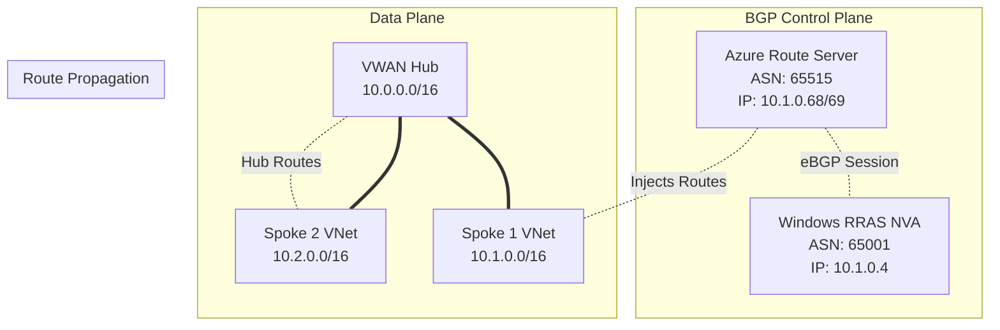
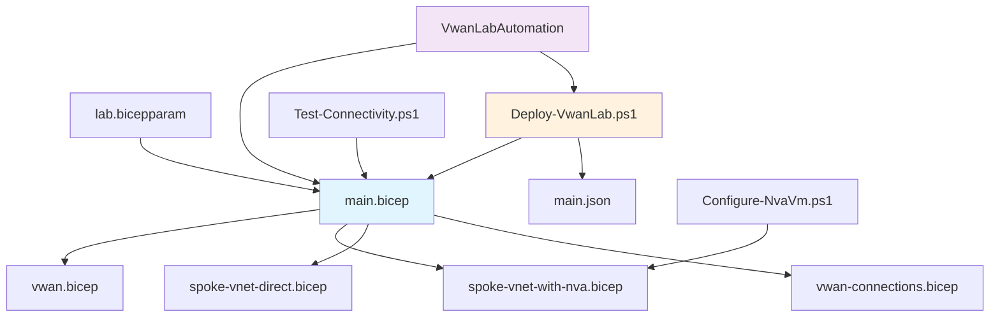
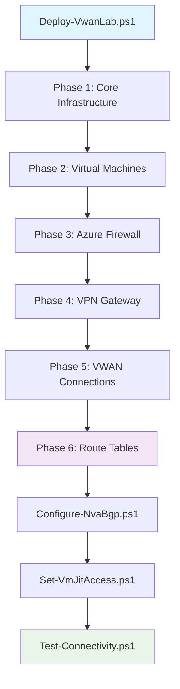
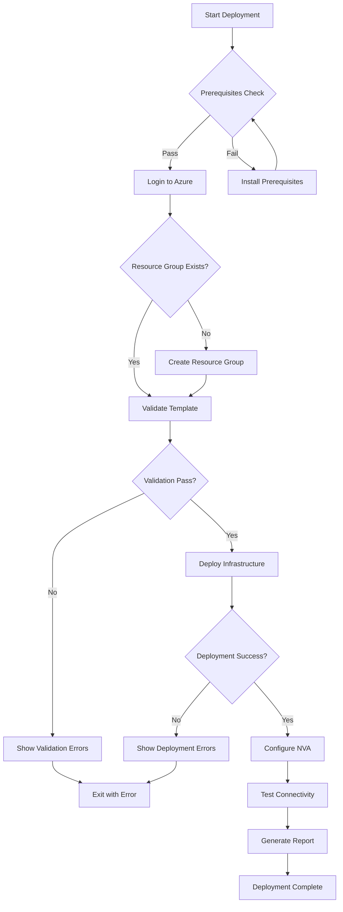

# 🛠️ Azure Virtual WAN Lab - Developer Guide

<div align="center">


*Comprehensive technical documentation for developers working on the Azure Virtual WAN lab project*

</div>

---

## 📋 Table of Contents

- [🏗️ Project Architecture](#️-project-architecture)
- [🧩 Component Deep Dive](#-component-deep-dive)
- [📁 Project Structure](#-project-structure)
- [🔧 Development Environment](#-development-environment)
- [📝 Infrastructure as Code](#-infrastructure-as-code)
- [⚙️ Automation & Scripting](#️-automation--scripting)
- [� Security Implementation](#-security-implementation) - **NEW**
- [🤖 .NET Automation Suite](#-net-automation-suite) - **NEW**
- [🌐 Multi-Region Architecture](#-multi-region-architecture) - **NEW**
- [�🔀 Build & Deployment Pipeline](#-build--deployment-pipeline)
- [🧪 Testing Strategy](#-testing-strategy)
- [🐛 Debugging & Troubleshooting](#-debugging--troubleshooting)
- [🚀 Extending the Project](#-extending-the-project)
- [📊 Performance Considerations](#-performance-considerations)
- [📈 Monitoring & Observability](#-monitoring--observability)

---

## 🏗️ Project Architecture

### **🎯 Design Principles**

This project was built following modern DevOps and Infrastructure as Code principles:

#### **1. Modularity & Reusability**
```
bicep/
├── main.bicep                      # Orchestration template
├── modules/
│   ├── vwan.bicep                 # Self-contained VWAN module
│   ├── spoke-vnet-with-nva.bicep  # Complex networking with BGP
│   ├── spoke-vnet-direct.bicep    # Simple spoke implementation
│   ├── spoke-vnet-multisubnet.bicep # Multi-subnet spoke design
│   ├── vm-*.bicep                 # VM deployment modules
│   └── vwan-connections.bicep     # Connection orchestration
├── phases/
│   ├── phase1-*.bicep             # Infrastructure deployment
│   ├── phase2-*.bicep             # VM deployment
│   ├── phase3-*.bicep             # Service deployment
│   ├── phase4-*.bicep             # Connectivity deployment
│   ├── phase5-*.bicep             # BGP and routing
│   └── phase6-*.bicep             # Final configuration
└── parameters/
    ├── lab.bicepparam             # Classic lab configuration
    ├── lab-multiregion.bicepparam # Multi-region configuration
    └── lab-phase*.bicepparam      # Phase-specific parameters
```

#### **2. Security-First Design (SFI - Secure Future Initiative)**
```
Security Architecture:
├── Just-In-Time (JIT) VM Access
│   ├── Microsoft Defender for Cloud integration
│   ├── REST API automation
│   └── NSG fallback security
├── Automated IP Detection
├── Auto-Shutdown Scheduling
└── Network Security Hardening
```

#### **3. Multi-Architecture Support**
```
Deployment Options:
├── Classic Architecture (v1.0)
│   ├── Single VWAN hub
│   ├── Route Server integration
│   └── BGP peering scenarios
└── Multi-Region Architecture (v2.0)
    ├── 3 VWAN hubs (West US, Central US, Southeast Asia)
    ├── Azure Firewall Premium
    ├── Cross-region connectivity
    └── VPN Site-to-Site integration
```

#### **2. Multi-Tool Ecosystem**
- **Bicep**: Primary IaC with ARM fallback capability
- **PowerShell**: Deployment automation and VM configuration
- **.NET 8**: Advanced automation and monitoring tools
- **Azure CLI**: Cross-platform deployment support

#### **3. Error Resilience**
- **Automatic fallback mechanisms** (Bicep → ARM)
- **Comprehensive error handling** in all scripts
- **Detailed validation** before deployment
- **Rollback capabilities** through infrastructure versioning

### **🌐 Network Architecture Deep Dive**

#### **Addressing Scheme Design**

| Network Segment | CIDR | Purpose | Design Rationale |
|-----------------|------|---------|------------------|
| **VWAN Hub** | `10.0.0.0/16` | Central connectivity | Large address space for scalability |
| **Spoke 1** | `10.1.0.0/16` | NVA + Route Server | /26 subnets for precise control |
| **Spoke 2** | `10.2.0.0/16` | Direct connection | Standard hub-spoke model |

#### **Subnet Breakdown (Spoke 1)**

```bicep
// Calculated subnet architecture
var baseNetwork = '10.1.0'
var nvaSubnet = '${baseNetwork}.0/26'      // 10.1.0.0-10.1.0.63
var arsSubnet = '${baseNetwork}.64/26'     // 10.1.0.64-10.1.0.127  
var vmSubnet = '${baseNetwork}.128/26'     // 10.1.0.128-10.1.0.191
```

**Why /26 subnets?**
- **Azure Route Server**: Requires dedicated `/27` minimum subnet
- **NVA separation**: Isolates routing appliance traffic
- **Future expansion**: Room for additional subnets (64 addresses each)
- **Azure compliance**: Meets all Azure networking requirements

#### **BGP Routing Architecture**



**BGP Session Details:**
- **Protocol**: eBGP (External BGP)
- **Authentication**: None (internal lab environment)
- **Route Filtering**: Accept all routes
- **Timers**: Default BGP timers (Keepalive: 60s, Hold: 180s)

---

## 🧩 Component Deep Dive

### **1. Virtual WAN Hub (`modules/vwan.bicep`)**

#### **Design Decisions**

```bicep
resource virtualWanHub 'Microsoft.Network/virtualHubs@2023-05-01' = {
  name: vwanHubName
  location: location
  properties: {
    addressPrefix: vwanHubAddressPrefix
    virtualWan: {
      id: virtualWan.id
    }
    sku: 'Standard'  // Required for BGP and custom routing
  }
}
```

**Why Standard SKU?**
- **BGP Support**: Basic SKU doesn't support BGP routing
- **Custom Routing**: Required for complex routing scenarios
- **ExpressRoute**: Future-proofs for ExpressRoute connectivity
- **VPN Gateway**: Enables site-to-site VPN scenarios

#### **Resource Dependencies**

```bicep
// Explicit dependency chain
Virtual WAN → Virtual WAN Hub → Route Tables → Connections
```

### **2. NVA Implementation (`modules/spoke-vnet-with-nva.bicep`)**

#### **Windows Server RRAS Configuration**

The NVA uses Windows Server 2022 with Routing and Remote Access Service (RRAS):

```bicep
resource nvaVm 'Microsoft.Compute/virtualMachines@2023-03-01' = {
  properties: {
    osProfile: {
      computerName: nvaVmName
      adminUsername: adminUsername
      adminPassword: adminPassword
      windowsConfiguration: {
        enableAutomaticUpdates: false  // Prevents reboot during lab
        provisionVMAgent: true
      }
    }
    hardwareProfile: {
      vmSize: vmSize
    }
    networkProfile: {
      networkInterfaces: [{
        id: nvaNetworkInterface.id
        properties: {
          primary: true
        }
      }]
    }
  }
}
```

#### **IP Forwarding Configuration**

```bicep
resource nvaNetworkInterface 'Microsoft.Network/networkInterfaces@2023-05-01' = {
  properties: {
    enableIPForwarding: true  // Critical for NVA functionality
    ipConfigurations: [{
      properties: {
        privateIPAllocationMethod: 'Static'
        privateIPAddress: '10.1.0.4'  // Predictable IP for BGP
        subnet: {
          id: nvaSubnet.id
        }
      }
    }]
  }
}
```

**Why Static IP?**
- **BGP Neighbor Configuration**: Route Server needs predictable peer IP
- **Routing Consistency**: Prevents IP changes from breaking BGP sessions
- **Troubleshooting**: Makes debugging easier with known addresses

### **3. Azure Route Server (`modules/spoke-vnet-with-nva.bicep`)**

#### **Implementation Details**

```bicep
resource azureRouteServer 'Microsoft.Network/virtualHubs@2023-05-01' = {
  name: routeServerName
  location: location
  properties: {
    sku: 'Standard'
    allowBranchToBranchTraffic: true  // Enables spoke-to-spoke via NVA
  }
}

resource routeServerSubnet 'Microsoft.Network/virtualNetworks/subnets@2023-05-01' = {
  name: 'RouteServerSubnet'  // Must be exactly this name
  properties: {
    addressPrefix: arsSubnetPrefix
    delegations: []
  }
}
```

#### **BGP Peering Configuration**

```bicep
resource bgpConnection 'Microsoft.Network/virtualHubs/bgpConnections@2023-05-01' = {
  parent: azureRouteServer
  name: 'bgp-connection-nva'
  properties: {
    peerAsn: 65001  // NVA's BGP ASN
    peerIp: '10.1.0.4'  // NVA's static IP
  }
}
```

**Route Server Technical Details:**
- **Management IP**: Auto-assigned by Azure (typically .68/.69)
- **ASN**: Always 65515 (Microsoft reserved ASN)
- **Route Advertisement**: Automatically advertises VNet routes
- **Route Learning**: Learns routes from BGP peers and injects into VNet

### **4. VWAN Connections (`modules/vwan-connections.bicep`)**

#### **Connection Types**

```bicep
// Spoke 1: Complex routing via Route Server
resource spokeVnet1Connection 'Microsoft.Network/virtualHubs/hubVirtualNetworkConnections@2023-05-01' = {
  properties: {
    remoteVirtualNetwork: {
      id: spokeVnet1Id
    }
    allowHubToRemoteVnetTransit: true
    allowRemoteVnetToHubTransit: true
    enableInternetSecurity: false  // Allows internet access via spoke
  }
}

// Spoke 2: Standard VWAN connectivity
resource spokeVnet2Connection 'Microsoft.Network/virtualHubs/hubVirtualNetworkConnections@2023-05-01' = {
  properties: {
    remoteVirtualNetwork: {
      id: spokeVnet2Id
    }
    allowHubToRemoteVnetTransit: true
    allowRemoteVnetToHubTransit: true
    enableInternetSecurity: false
  }
}
```

**Connection Design Rationale:**
- **Bidirectional Transit**: Enables hub-spoke and spoke-spoke communication
- **Internet Security Disabled**: Maintains existing internet access patterns
- **No Route Tables**: Uses default routing (can be customized later)

---

## 📁 Project Structure

### **📂 Directory Organization**

```
azure-vwan-lab/
├── 📁 bicep/                    # Infrastructure as Code
│   ├── 📄 main.bicep           # Main orchestration template
│   ├── 📄 main.json            # Compiled ARM template (auto-generated)
│   ├── 📁 modules/             # Reusable Bicep modules
│   │   ├── 📄 vwan.bicep       # Virtual WAN and hub
│   │   ├── 📄 spoke-vnet-with-nva.bicep  # Complex spoke with BGP
│   │   ├── 📄 spoke-vnet-direct.bicep    # Simple spoke
│   │   └── 📄 vwan-connections.bicep     # VNet connections
│   └── 📁 parameters/          # Environment configurations
│       └── 📄 lab.bicepparam   # Lab-specific parameters
├── 📁 arm-templates/           # ARM Template fallbacks
│   ├── 📄 main.json           # Compiled ARM template
│   └── 📁 parameters/
│       └── 📄 lab.parameters.json
├── 📁 scripts/                # PowerShell automation
│   ├── 📄 Deploy-VwanLab.ps1         # Main deployment script
│   ├── 📄 Configure-NvaVm.ps1        # NVA post-deployment config
│   ├── 📄 Test-Connectivity.ps1      # Connectivity validation
│   └── 📄 Troubleshoot-VwanLab.ps1   # Diagnostic automation
├── 📁 src/                    # .NET automation tools
│   └── 📁 VwanLabAutomation/  # C# automation project
│       ├── 📄 Program.cs       # CLI entry point
│       ├── 📄 VwanLabDeployer.cs     # Deployment logic
│       ├── 📄 VwanLabMonitor.cs      # Status monitoring
│       ├── 📄 VwanLabTester.cs       # Connectivity testing
│       └── 📄 VwanLabCleaner.cs      # Resource cleanup
├── 📁 docs/                   # Documentation
│   ├── 📄 user-guide.md       # End-user documentation
│   ├── 📄 developer-guide.md  # This document
│   ├── 📄 troubleshooting.md  # Troubleshooting guide
│   └── 📄 architecture.md     # Technical architecture
└── 📁 .vscode/               # VS Code configuration
    └── 📄 tasks.json         # Build and deployment tasks
```

### **🔄 File Relationships**



---

## 🔧 Development Environment

### **🛠️ Required Tools & Versions**

| Tool | Minimum Version | Recommended | Purpose |
|------|----------------|-------------|---------|
| **PowerShell** | 5.1 | 7.3+ | Script execution and Azure automation |
| **Azure CLI** | 2.50.0 | Latest | Cross-platform Azure management |
| **Bicep CLI** | 0.20.0 | Latest | Infrastructure as Code |
| **Azure PowerShell** | 9.0.0 | Latest | PowerShell-based Azure management |
| **.NET SDK** | 8.0 | 8.0 LTS | C# automation tools |
| **VS Code** | 1.80.0 | Latest | Development environment |

### **🔌 VS Code Extensions**

```json
{
  "recommendations": [
    "ms-azuretools.vscode-bicep",     // Bicep language support
    "ms-vscode.azure-account",        // Azure authentication
    "ms-vscode.powershell",           // PowerShell debugging
    "ms-dotnettools.vscode-dotnet-runtime", // .NET support
    "ms-azuretools.vscode-azureresourcegroups" // Resource management
  ]
}
```

### **⚙️ Development Configuration**

#### **VS Code Tasks (`tasks.json`)**

```json
{
  "version": "2.0.0",
  "inputs": [
    {
      "id": "resourceGroupName",
      "description": "Resource Group Name",
      "default": "rg-networking-multi-vwanlab",
      "type": "promptString"
    }
  ],
  "tasks": [
    {
      "label": "Build Bicep Templates",
      "type": "shell",
      "command": "az",
      "args": ["bicep", "build", "--file", "./bicep/main.bicep"],
      "group": "build",
      "problemMatcher": []
    },
    {
      "label": "Validate Bicep Templates", 
      "type": "shell",
      "command": "az",
      "args": [
        "deployment", "group", "validate",
        "--resource-group", "${input:resourceGroupName}",
        "--template-file", "./bicep/main.bicep",
        "--parameters", "./bicep/parameters/lab.bicepparam"
      ],
      "group": "test"
    }
  ]
}
```

**Design Rationale:**
- **Input Prompts**: Dynamic resource group selection
- **Problem Matchers**: Integration with VS Code's error highlighting
- **Task Groups**: Organized by build, test, and deployment phases

---

## � Script Architecture & Automation

### **📋 PowerShell Script Ecosystem**

The project includes a comprehensive set of PowerShell scripts organized by function and complexity. All scripts support the current multi-region architecture and flexible VM naming patterns.

#### **🎯 Core Deployment Scripts**

| Script | Purpose | Architecture Support | Key Features |
|--------|---------|---------------------|--------------|
| **Deploy-VwanLab.ps1** | Main deployment orchestrator | Classic & Multi-Region | 6-phase deployment, auto-RDP, SFI support |
| **Deploy-VwanLab-MultiRegion.ps1** | Multi-region specialized | Multi-Region Only | 3-hub deployment, cross-region connectivity |
| **Deploy-VwanLab-Phased.ps1** | Legacy phased deployment | Classic Only | 5-phase classic architecture |

#### **⚡ Quick Deployment Examples**

```powershell
# Deploy multi-region with SFI and auto-shutdown
./scripts/Deploy-VwanLab.ps1 -ResourceGroupName "rg-vwanlab-demo" -SfiEnable -EnableAutoShutdown

# Deploy specific phase with custom parameters
./scripts/Deploy-VwanLab.ps1 -ResourceGroupName "rg-vwanlab-test" -Phase 3

# Deploy with what-if analysis
./scripts/Deploy-VwanLab.ps1 -ResourceGroupName "rg-vwanlab-demo" -WhatIf
```

#### **🔒 Security & Management Scripts**

| Script | Purpose | VM Pattern Support | Integration |
|--------|---------|-------------------|-------------|
| **Set-VmJitAccess.ps1** | Just-In-Time VM access | vm-s*, *vwanlab*, *nva*, *rras*, *spoke* | REST API automation, 24h policies |
| **Set-VmAutoShutdown.ps1** | Automated VM shutdown | All patterns | Cost optimization, policy enforcement |
| **Fix-RrasService.ps1** | RRAS service repair | RRAS VMs | BGP troubleshooting automation |

**Enhanced JIT Access Example:**
```powershell
# Configure JIT access for all VMs with 24-hour policies
./scripts/Set-VmJitAccess.ps1 -ResourceGroupName "rg-vwanlab-demo" -VerboseLogging

# Request immediate access for all VMs via REST API
./scripts/Set-VmJitAccess.ps1 -ResourceGroupName "rg-vwanlab-demo" -RequestAccess
```

#### **🔍 Diagnostic & Monitoring Scripts**

| Script | Purpose | Output Format | Use Case |
|--------|---------|---------------|----------|
| **Check-VwanBgpArchitecture.ps1** | BGP architecture validation | Structured report | Pre-deployment validation |
| **Get-BgpStatus.ps1** | BGP peering status | Detailed status table | Troubleshooting connectivity |
| **Test-Connectivity.ps1** | End-to-end connectivity | Pass/fail with details | Post-deployment verification |
| **Get-LabStatus.ps1** | Overall lab health | Comprehensive dashboard | Operations monitoring |

#### **🏗️ Configuration Scripts**

| Script | Purpose | Automation Level | Dependencies |
|--------|---------|------------------|--------------|
| **Configure-NvaBgp.ps1** | BGP peering setup | Fully automated | VM deployment complete |
| **Configure-NvaVm.ps1** | NVA VM configuration | Semi-automated | PowerShell remoting |
| **Validate-RrasConfiguration.ps1** | RRAS validation | Diagnostic only | RRAS service running |

#### **🧹 Cleanup & Maintenance Scripts**

| Script | Purpose | Safety Level | Scope |
|--------|---------|--------------|-------|
| **Cleanup-ResourceGroups.ps1** | Resource group cleanup | Interactive prompts | Multiple RGs |
| **Manage-Cleanup.ps1** | Selective resource cleanup | Confirmation required | Targeted resources |

### **🔄 Script Integration Patterns**

#### **Deployment Orchestration Flow**



#### **Error Handling Strategy**

```powershell
# Standard error handling pattern used across all scripts
try {
    Write-Host "Starting operation..." -ForegroundColor Yellow
    
    # Operation logic here
    $result = Invoke-SomeOperation
    
    Write-Host "✅ Operation completed successfully" -ForegroundColor Green
    return $result
}
catch {
    Write-Error "❌ Operation failed: $($_.Exception.Message)"
    Write-Host "🔍 Troubleshooting: Check logs for details" -ForegroundColor Cyan
    throw
}
finally {
    Write-Host "🧹 Cleaning up temporary resources..." -ForegroundColor Gray
}
```

### **⚙️ .NET Automation Suite**

#### **VwanLabAutomation Console Application**

Located in `src/VwanLabAutomation/`, this C# application provides enterprise-grade lab management:

```bash
# Build the automation suite
dotnet build ./src/VwanLabAutomation/VwanLabAutomation.csproj

# Get comprehensive lab status
dotnet run --project ./src/VwanLabAutomation -- status --subscription <sub-id> --resource-group <rg-name>

# Perform intelligent cleanup
dotnet run --project ./src/VwanLabAutomation -- cleanup --subscription <sub-id> --resource-group <rg-name>
```

**Key Features:**
- **Intelligent Resource Discovery**: Identifies VWAN lab resources automatically
- **Dependency-Aware Cleanup**: Removes resources in correct order
- **Cost Analysis**: Provides cost breakdown and optimization recommendations
- **Health Monitoring**: Comprehensive lab health diagnostics

---

## �📝 Infrastructure as Code

### **🎯 Bicep Design Patterns**

#### **1. Phased Deployment Architecture**

The project uses a phased deployment approach to prevent Azure timeout issues and enable granular control:

```
bicep/phases/
├── phase1-core.bicep          # Core infrastructure (VWAN, VNets, NSGs)
├── phase2-vms.bicep           # Virtual machines and compute resources
├── phase3-firewall.bicep      # Azure Firewall Premium (multi-region)
├── phase4-vpngateway.bicep    # VPN Gateway for BGP testing
├── phase5-connections.bicep   # VWAN connections and VNet peerings
└── phase6-routing.bicep       # Route tables and traffic steering
```

**Deployment Benefits:**
- **Timeout Prevention**: Large deployments split into manageable phases
- **Dependency Management**: Each phase completes before next begins
- **Selective Deployment**: Deploy only specific phases when needed
- **Error Isolation**: Issues contained to specific infrastructure layers

#### **2. Modular Component Design**

```bicep
// Main template orchestrates modules
module vwan 'modules/vwan.bicep' = {
  name: 'vwan-deployment'
  params: {
    vwanName: vwanName
    vwanHubName: vwanHubName
    vwanHubAddressPrefix: vwanHubAddressPrefix
    location: primaryRegion
    tags: tags
  }
}

// VM modules with flexible naming support
module nvaVm 'modules/vm-nva.bicep' = {
  name: 'nva-vm-deployment'
  params: {
    vmName: 'vm-s1-nva-${environmentPrefix}'  // Current naming pattern
    vmSize: vmSize
    adminUsername: adminUsername
    adminPassword: adminPassword
  }
}
```

**Module Categories:**
- **Core Infrastructure**: `vwan.bicep`, `spoke-vnet-*.bicep`
- **Compute Resources**: `vm-*.bicep` (Windows, Linux, NVA variants)
- **Connectivity**: `vnet-peering.bicep`, `vwan-connections.bicep`

#### **3. Parameter Management**

```bicep
// Parameter file structure (lab.bicepparam)
using './main.bicep'

param environmentPrefix = 'vwanlab'
param primaryRegion = 'East US'
param adminUsername = 'azureuser'
param adminPassword = readEnvironmentVariable('ADMIN_PASSWORD', 'SecureP@ssw0rd123!')
param vmSize = 'Standard_D2s_v3'

// Multi-region parameter structure
param regions = {
  westUS: {
    name: 'West US'
    addressPrefix: '10.0.0.0/12'    // Regional summary block
    hubAddressPrefix: '10.200.0.0/24'
  }
  centralUS: {
    name: 'Central US'
    addressPrefix: '10.201.0.0/24'
    hasVpnGateway: true
  }
  southeastAsia: {
    name: 'Southeast Asia'
    addressPrefix: '10.202.0.0/24'
    spoke2AddressPrefix: '10.32.1.0/26'
  }
}
```

**Parameter Design Principles:**
- **Environment Variables**: Secrets from environment, not hardcoded
- **Sensible Defaults**: Working configuration out-of-the-box
- **Type Safety**: Strong typing prevents deployment errors
- **Documentation**: Clear descriptions for all parameters

#### **3. Resource Naming Strategy**

```bicep
// Consistent naming convention
var vwanName = '${environmentPrefix}-vwan'
var vwanHubName = '${environmentPrefix}-hub'
var spokeVnet1Name = '${environmentPrefix}-spoke1-vnet'
var nvaVmName = '${environmentPrefix}-nva-vm'
```

**Naming Convention:**
- **Format**: `{environmentPrefix}-{component}-{type}`
- **Benefits**: Easy identification, consistent patterns
- **Flexibility**: Environment prefix allows multiple deployments
- **Azure Compliance**: Meets Azure naming requirements

#### **4. Error Handling in Bicep**

```bicep
// Conditional resource creation
resource publicIP 'Microsoft.Network/publicIPAddresses@2023-05-01' = if (createPublicIP) {
  name: '${vmName}-pip'
  location: location
  properties: {
    publicIPAllocationMethod: 'Static'
    sku: {
      name: 'Standard'
    }
  }
}

// Safe property access
var publicIPId = createPublicIP ? publicIP.id : null
```

### **🔄 ARM Template Fallback Strategy**

#### **Compilation Process**

```powershell
# Automatic ARM compilation in deployment script
try {
    # Try Bicep first
    Write-Host "Compiling Bicep template..." -ForegroundColor Yellow
    az bicep build --file $bicepTemplate
    $templateFile = $bicepTemplate.Replace('.bicep', '.json')
} catch {
    # Fallback to pre-compiled ARM
    Write-Warning "Bicep compilation failed, using ARM template fallback"
    $templateFile = $armTemplate
}
```

**Why ARM Fallback?**
- **Bicep CLI Issues**: Not everyone has Bicep installed
- **CI/CD Compatibility**: Some pipelines don't support Bicep
- **Reliability**: Always have a working deployment path
- **Legacy Support**: Works with older Azure CLI versions

---

## ⚙️ Automation & Scripting

### **🔧 PowerShell Architecture**

#### **Main Deployment Script (`Deploy-VwanLab.ps1`)**

```powershell
[CmdletBinding()]
param(
    [Parameter(Mandatory = $true)]
    [string]$ResourceGroupName,
    
    [Parameter(Mandatory = $false)]
    [string]$ParameterFile = ".\bicep\parameters\lab.bicepparam",
    
    [Parameter(Mandatory = $false)]
    [switch]$WhatIf,
    
    [Parameter(Mandatory = $false)]
    [switch]$SkipNvaConfiguration
)
```

**Script Design Principles:**
- **Parameter Validation**: Strong typing and mandatory parameters
- **Switch Parameters**: Boolean flags for different behaviors
- **Default Values**: Sensible defaults for optional parameters
- **Help Documentation**: Comprehensive help with examples

#### **Error Handling Strategy**

```powershell
function Deploy-Template {
    try {
        # Check if Bicep is available
        $bicepAvailable = Test-BicepAvailability
        
        if ($bicepAvailable) {
            $templateFile = Get-BicepTemplate
        } else {
            $templateFile = Get-ArmFallback
        }
        
        # Deploy template
        $deployment = New-AzResourceGroupDeployment @deploymentParams
        
    } catch {
        Write-Error "Deployment failed: $($_.Exception.Message)"
        
        # Provide specific troubleshooting guidance
        if ($_.Exception.Message -like "*quota*") {
            Write-Warning "This appears to be a quota issue. Check your subscription limits."
        }
        
        throw
    }
}
```

#### **Path Conversion Logic**

```powershell
function Convert-BicepToArmPath {
    param([string]$BicepPath)
    
    # Handle different path formats
    $armPath = $BicepPath -replace '\.bicep$', '.json'
    $armPath = $armPath -replace '\\bicep\\', '\arm-templates\'
    $armPath = $armPath -replace '/bicep/', '/arm-templates/'
    
    return $armPath
}
```

**Why Complex Path Handling?**
- **Cross-Platform**: Works on Windows, Linux, macOS
- **Relative Paths**: Handles different working directories
- **File System Differences**: Accounts for path separator variations

### **🎯 .NET Automation Tool**

#### **Project Structure (`src/VwanLabAutomation/`)**

```csharp
// Program.cs - CLI entry point
public class Program
{
    public static async Task<int> Main(string[] args)
    {
        var app = new CommandLineApplication();
        app.Name = "VwanLabAutomation";
        app.Description = "Azure Virtual WAN Lab automation tool";
        
        // Register commands
        app.Command("deploy", DeployCommand.Configure);
        app.Command("status", StatusCommand.Configure);
        app.Command("test", TestCommand.Configure);
        app.Command("cleanup", CleanupCommand.Configure);
        
        return await app.ExecuteAsync(args);
    }
}
```

#### **Azure SDK Integration**

```csharp
// VwanLabMonitor.cs - Resource monitoring
public class VwanLabMonitor
{
    private readonly ResourceManagementClient _resourceClient;
    private readonly NetworkManagementClient _networkClient;
    
    public async Task<LabStatus> GetLabStatusAsync(string resourceGroupName)
    {
        var resources = await _resourceClient.Resources.ListByResourceGroupAsync(resourceGroupName);
        
        var status = new LabStatus
        {
            VirtualWan = await CheckVirtualWanAsync(resourceGroupName),
            VirtualHub = await CheckVirtualHubAsync(resourceGroupName),
            SpokeVnets = await CheckSpokeVnetsAsync(resourceGroupName),
            BgpPeering = await CheckBgpPeeringAsync(resourceGroupName)
        };
        
        return status;
    }
}
```

**Why .NET for Automation?**
- **Azure SDK**: Rich, strongly-typed Azure management APIs
- **Performance**: Faster than PowerShell for complex operations
- **Cross-Platform**: Runs on Windows, Linux, macOS
- **Maintainability**: Strong typing reduces runtime errors

---

## 🔀 Build & Deployment Pipeline

### **🚀 Deployment Flow**



### **📋 Validation Stages**

#### **1. Pre-deployment Validation**

```powershell
function Test-Prerequisites {
    $checks = @()
    
    # Check Azure CLI
    $checks += Test-AzureCLI
    
    # Check PowerShell modules
    $checks += Test-PowerShellModules
    
    # Check Azure authentication
    $checks += Test-AzureAuthentication
    
    # Check template files
    $checks += Test-TemplateFiles
    
    return $checks | Where-Object { $_.Status -eq 'Failed' }
}
```

#### **2. Template Validation**

```powershell
# Azure template validation
$validation = Test-AzResourceGroupDeployment `
    -ResourceGroupName $ResourceGroupName `
    -TemplateFile $templateFile `
    -TemplateParameterFile $parameterFile
    
if ($validation) {
    Write-Error "Template validation failed:"
    $validation | ForEach-Object {
        Write-Error "  - $($_.Message)"
    }
    return $false
}
```

#### **3. Post-deployment Verification**

```powershell
function Test-DeploymentSuccess {
    # Check resource creation
    $resources = Get-AzResource -ResourceGroupName $ResourceGroupName
    
    $expectedResources = @(
        'Microsoft.Network/virtualWans',
        'Microsoft.Network/virtualHubs', 
        'Microsoft.Network/virtualNetworks',
        'Microsoft.Compute/virtualMachines'
    )
    
    foreach ($type in $expectedResources) {
        if (!($resources | Where-Object ResourceType -eq $type)) {
            throw "Missing resource type: $type"
        }
    }
}
```

---

## 🧪 Testing Strategy

### **🔍 Test Categories**

#### **1. Template Validation (Bicep)**

```powershell
# Validate individual phases
foreach ($phase in 1..6) {
    Write-Host "Validating Phase $phase..." -ForegroundColor Yellow
    
    $templatePath = "./bicep/phases/phase$phase-*.bicep"
    $template = Get-ChildItem $templatePath
    
    if ($template) {
        az bicep build --file $template.FullName
        if ($LASTEXITCODE -eq 0) {
            Write-Host "✅ Phase $phase template valid" -ForegroundColor Green
        } else {
            Write-Error "❌ Phase $phase template has errors"
        }
    }
}
```

#### **2. Pre-Deployment Validation**

```powershell
# Test deployment with what-if analysis
./scripts/Deploy-VwanLab.ps1 -ResourceGroupName "rg-test-validation" -WhatIf

# Validate specific phase only
./scripts/Deploy-VwanLab.ps1 -ResourceGroupName "rg-test-validation" -Phase 1 -WhatIf
```

#### **3. Post-Deployment Testing**

```powershell
# Comprehensive connectivity testing
./scripts/Test-Connectivity.ps1 -ResourceGroupName "rg-vwanlab-test" -Detailed

# BGP architecture validation
./scripts/Check-VwanBgpArchitecture.ps1 -ResourceGroupName "rg-vwanlab-test"

# VM accessibility verification (JIT/RDP)
./scripts/Set-VmJitAccess.ps1 -ResourceGroupName "rg-vwanlab-test" -RequestAccess
```

#### **4. End-to-End Integration Tests**

```powershell
# Full deployment cycle test
function Test-FullDeploymentCycle {
    param([string]$TestResourceGroup)
    
    try {
        # Deploy all phases
        $deployment = ./scripts/Deploy-VwanLab.ps1 -ResourceGroupName $TestResourceGroup
        
        # Validate BGP peering
        $bgpStatus = ./scripts/Get-BgpStatus.ps1 -ResourceGroupName $TestResourceGroup
        
        # Test connectivity
        $connectivityResults = ./scripts/Test-Connectivity.ps1 -ResourceGroupName $TestResourceGroup -Detailed
        
        # Verify JIT access
        ./scripts/Set-VmJitAccess.ps1 -ResourceGroupName $TestResourceGroup -RequestAccess
        
        Write-Host "✅ All tests passed" -ForegroundColor Green
        return $true
    }
    catch {
        Write-Error "❌ Test failed: $($_.Exception.Message)"
        return $false
    }
}
```

### **🎯 Automated Testing with .NET Suite**

#### **Lab Health Monitoring**

```csharp
// VwanLabAutomation health checks
public class LabHealthTests
{
    [Test]
    public async Task ShouldValidateAllVmsRunning()
    {
        var vms = await DiscoverLabVMs();
        foreach (var vm in vms)
        {
            var status = await GetVmPowerState(vm);
            Assert.That(status, Is.EqualTo("VM running"));
        }
    }
    
    [Test]
    public async Task ShouldValidateBgpPeeringSessions()
    {
        var routeServer = await GetRouteServerStatus();
        Assert.That(routeServer.BgpConnections.Count, Is.GreaterThan(0));
        
        foreach (var connection in routeServer.BgpConnections)
        {
            Assert.That(connection.ConnectionState, Is.EqualTo("Connected"));
        }
    }
}
```

#### **Cost Validation Testing**

```bash
# Test cost optimization features
dotnet run --project ./src/VwanLabAutomation -- status \
  --subscription $AZURE_SUBSCRIPTION_ID \
  --resource-group "rg-vwanlab-cost-test" \
  --cost-analysis
```

### **📊 Test Reporting**

#### **VS Code Testing Integration**

```json
// .vscode/settings.json
{
  "powershell.scriptAnalysis.enable": true,
  "files.associations": {
    "*.bicep": "bicep",
    "*.bicepparam": "bicep"
  },
  "azure-pipelines.customSchemaFile": ".vscode/azure-pipelines.schema.json"
}
```

#### **Test Results Dashboard**

```powershell
# Generate test report
function New-TestReport {
    param([string]$ResourceGroupName)
    
    $report = @{
        Timestamp = Get-Date
        ResourceGroup = $ResourceGroupName
        TemplateValidation = Test-BicepTemplates
        DeploymentStatus = Get-DeploymentStatus $ResourceGroupName
        ConnectivityTests = Test-NetworkConnectivity $ResourceGroupName
        SecurityValidation = Test-JitAccessConfiguration $ResourceGroupName
        CostAnalysis = Get-LabCostAnalysis $ResourceGroupName
    }
    
    $report | ConvertTo-Json -Depth 5 | Out-File "test-results-$(Get-Date -Format 'yyyyMMdd-HHmmss').json"
}
```

---

## 🐛 Debugging & Troubleshooting

### **🔍 Common Issues & Solutions**

#### **Issue 1: VM Detection in Scripts**

**Problem:** Scripts can't find VMs due to naming pattern mismatches

**Symptoms:**
```
No VMs found matching pattern '*vwanlab*'
```

**Solution:** Use the updated scripts with flexible VM pattern matching:
```powershell
# Enhanced VM detection in Set-VmJitAccess.ps1
$vmPatterns = @('vm-s*', '*vwanlab*', '*nva*', '*rras*', '*spoke*')
$vms = @()
foreach ($pattern in $vmPatterns) {
    $foundVms = Get-AzVM -ResourceGroupName $ResourceGroupName | Where-Object { $_.Name -like $pattern }
    if ($foundVms) { $vms += $foundVms }
}
```

#### **Issue 2: Deployment Timeout Errors**

**Problem:** Large deployments timing out on Azure Resource Manager

**Symptoms:**
```
The deployment 'main' failed with error: The request was aborted: The operation has timed out.
```

**Solution:** Use phased deployment approach:
```powershell
# Deploy specific phases to avoid timeouts
./scripts/Deploy-VwanLab.ps1 -ResourceGroupName "rg-test" -Phase 1  # Core infrastructure
./scripts/Deploy-VwanLab.ps1 -ResourceGroupName "rg-test" -Phase 2  # Virtual machines
./scripts/Deploy-VwanLab.ps1 -ResourceGroupName "rg-test" -Phase 3  # Azure Firewall
```

#### **Issue 3: BGP Peering Failures**

**Problem:** Route Server and NVA not establishing BGP session

**Diagnostic Commands:**
```powershell
# Use the comprehensive BGP status script
./scripts/Get-BgpStatus.ps1 -ResourceGroupName $resourceGroupName

# Check detailed BGP architecture
./scripts/Check-VwanBgpArchitecture.ps1 -ResourceGroupName $resourceGroupName

# Validate RRAS configuration
./scripts/Validate-RrasConfiguration.ps1 -ResourceGroupName $resourceGroupName
```

**Common Causes & Fixes:**
1. **RRAS Service Issues**: Use `./scripts/Fix-RrasService.ps1`
2. **BGP Configuration**: Run `./scripts/Configure-NvaBgp.ps1`
3. **Network Connectivity**: Check with `./scripts/Test-Connectivity.ps1`

#### **Issue 4: JIT Access Configuration**

**Problem:** Just-In-Time VM access not working

**Symptoms:**
```
Security Center Standard tier is required for Just-In-Time VM access
```

**Solution:**
```powershell
# Use the enhanced JIT script with automatic policy creation
./scripts/Set-VmJitAccess.ps1 -ResourceGroupName "rg-vwanlab-demo" -VerboseLogging

# Request immediate access via REST API
./scripts/Set-VmJitAccess.ps1 -ResourceGroupName "rg-vwanlab-demo" -RequestAccess
```

#### **Issue 5: Multi-Region Connectivity**

**Problem:** Cross-region connectivity not working in multi-region deployments

**Diagnostic Steps:**
```powershell
# Use multi-region specific deployment
./scripts/Deploy-VwanLab-MultiRegion.ps1 -ResourceGroupName "rg-multi-test"

# Test cross-region connectivity
./scripts/Test-Connectivity.ps1 -ResourceGroupName "rg-multi-test" -Detailed
```

### **🛠️ Debugging Tools & Scripts**

#### **Comprehensive Lab Status**

```powershell
# Get complete lab health status
./scripts/Get-LabStatus.ps1 -ResourceGroupName $resourceGroupName

# Use .NET automation for advanced diagnostics
dotnet run --project ./src/VwanLabAutomation -- status \
  --subscription $subscriptionId \
  --resource-group $resourceGroupName
```

#### **Network Connectivity Diagnostics**

```powershell
# Detailed connectivity testing
./scripts/Test-Connectivity.ps1 -ResourceGroupName $resourceGroupName -Detailed

# Troubleshoot specific networking issues
./scripts/Troubleshoot-VwanLab.ps1 -ResourceGroupName $resourceGroupName
```

#### **Template and Deployment Debugging**

```powershell
# Validate templates before deployment
az deployment group validate \
  --resource-group $resourceGroupName \
  --template-file "./bicep/phases/phase1-core.bicep" \
  --parameters "./bicep/parameters/lab.bicepparam"

# Use what-if analysis
./scripts/Deploy-VwanLab.ps1 -ResourceGroupName $resourceGroupName -WhatIf
```

### **📊 Diagnostic Data Collection**

#### **Automated Troubleshooting Report**

```powershell
function New-TroubleshootingReport {
    param([string]$ResourceGroupName)
    
    $report = @{
        Timestamp = Get-Date
        ResourceGroup = $ResourceGroupName
        
        # Resource status
        Resources = Get-AzResource -ResourceGroupName $ResourceGroupName
        
        # VM status
        VMs = Get-AzVM -ResourceGroupName $ResourceGroupName -Status
        
        # Network status
        VNets = Get-AzVirtualNetwork -ResourceGroupName $ResourceGroupName
        
        # BGP status (if applicable)
        BgpStatus = & "./scripts/Get-BgpStatus.ps1" -ResourceGroupName $ResourceGroupName
        
        # Connectivity results
        ConnectivityResults = & "./scripts/Test-Connectivity.ps1" -ResourceGroupName $ResourceGroupName -Detailed
    }
    
    $report | ConvertTo-Json -Depth 5 | Out-File "troubleshooting-report-$(Get-Date -Format 'yyyyMMdd-HHmmss').json"
    Write-Host "📊 Troubleshooting report saved" -ForegroundColor Green
}
```

#### **Error Log Analysis**

```powershell
# Get deployment errors
$deployment = Get-AzResourceGroupDeployment -ResourceGroupName $resourceGroupName -Name "main"
if ($deployment.ProvisioningState -eq "Failed") {
    Write-Host "❌ Deployment failed. Error details:" -ForegroundColor Red
    $deployment.StatusMessage | ConvertFrom-Json | Format-List
}
```

**Problem:**
```
Error: The CIDR '10.1.0.1/24' is not valid for a subnet
```

**Root Cause:**
```bicep
// Incorrect - produces invalid CIDR
var invalidSubnet = '${baseNetwork}.1/24'  // Results in 10.1.0.1/24
```

**Solution:**
```bicep
// Correct - produces valid CIDR
var validSubnet = '${baseNetwork}.0/26'    // Results in 10.1.0.0/26
```

**Prevention:**
```bicep
// Use cidrSubnet function for complex calculations
var dynamicSubnet = cidrSubnet(vnetAddressSpace, 26, 0)
```

#### **Issue 2: Template Scope Conflicts**

**Problem:**
```
Error: Resource type 'Microsoft.Resources/resourceGroups' is not supported in scope 'resourceGroup'
```

**Root Cause:**
```bicep
targetScope = 'subscription'  // Wrong scope
resource rg 'Microsoft.Resources/resourceGroups@2021-04-01' = {
  // This creates resource group, but we're deploying TO a resource group
}
```

**Solution:**
```bicep
targetScope = 'resourceGroup'  // Correct scope
// Remove resource group creation from template
```

#### **Issue 3: BGP Peering Failures**

**Problem:** Route Server and NVA not establishing BGP session

**Diagnostic Commands:**
```powershell
# Check Route Server status
az network routeserver show \
  --name "vwanlab-route-server" \
  --resource-group $resourceGroupName

# Check BGP peer status
az network routeserver peering show \
  --name "bgp-connection-nva" \
  --routeserver "vwanlab-route-server" \
  --resource-group $resourceGroupName
```

**Common Causes:**
1. **NVA not configured**: Run `Configure-NvaVm.ps1`
2. **IP forwarding disabled**: Check network interface settings
3. **NSG blocking traffic**: Verify security group rules
4. **Wrong ASN numbers**: Verify BGP configuration

### **🛠️ Debugging Tools**

#### **Template Debugging**

```powershell
# Enable detailed ARM deployment logging
$deployment = New-AzResourceGroupDeployment `
    -ResourceGroupName $resourceGroupName `
    -TemplateFile $templateFile `
    -DeploymentDebugLogLevel All `
    -Verbose
```

#### **Network Debugging**

```powershell
# Check effective routes on VM
az network nic show-effective-route-table \
  --name "vwanlab-test-vm1-nic" \
  --resource-group $resourceGroupName

# Check NSG effective rules
az network nic list-effective-nsg \
  --name "vwanlab-test-vm1-nic" \
  --resource-group $resourceGroupName
```

---

## 🚀 Extending the Project

### **🔧 Adding New Components**

#### **1. Creating New Bicep Modules**

```bicep
// Template for new module: modules/new-component.bicep
@description('Description of the new component')
param componentName string

@description('Location for resources')
param location string = resourceGroup().location

// Resource definitions
resource newResource 'Microsoft.SomeProvider/resourceType@2023-01-01' = {
  name: componentName
  location: location
  properties: {
    // Configuration
  }
}

// Outputs
output resourceId string = newResource.id
output resourceName string = newResource.name
```

#### **2. Integration with Main Template**

```bicep
// Add to main.bicep
module newComponent 'modules/new-component.bicep' = {
  name: 'new-component-deployment'
  params: {
    componentName: '${environmentPrefix}-new-component'
    location: primaryRegion
  }
}
```

### **📈 Scalability Enhancements**

#### **Multi-Region Deployment**

```bicep
// Support multiple regions
param regions array = ['East US', 'West US 2']

resource multiRegionVwan 'Microsoft.Network/virtualWans@2023-05-01' = {
  name: vwanName
  location: regions[0]  // Primary region
  properties: {
    type: 'Standard'
    allowBranchToBranchTraffic: true
  }
}

// Deploy hubs in each region
resource regionalHubs 'Microsoft.Network/virtualHubs@2023-05-01' = [for (region, i) in regions: {
  name: '${vwanHubName}-${i}'
  location: region
  properties: {
    addressPrefix: cidrSubnet('10.0.0.0/8', 16, i)
    virtualWan: {
      id: multiRegionVwan.id
    }
  }
}]
```

#### **Dynamic Spoke Creation**

```bicep
// Parameter-driven spoke deployment
param spokeConfigurations array = [
  {
    name: 'production'
    addressSpace: '10.1.0.0/16'
    hasNva: true
    region: 'East US'
  }
  {
    name: 'development'
    addressSpace: '10.2.0.0/16' 
    hasNva: false
    region: 'West US 2'
  }
]

module spokes 'modules/spoke-vnet-dynamic.bicep' = [for spoke in spokeConfigurations: {
  name: '${spoke.name}-spoke-deployment'
  params: {
    spokeName: spoke.name
    addressSpace: spoke.addressSpace
    hasNva: spoke.hasNva
    location: spoke.region
  }
}]
```

### **🔒 Security Enhancements**

#### **Network Security Groups**

```bicep
// Enhanced NSG with detailed rules
resource enhancedNsg 'Microsoft.Network/networkSecurityGroups@2023-05-01' = {
  name: '${environmentPrefix}-enhanced-nsg'
  location: location
  properties: {
    securityRules: [
      {
        name: 'AllowBGP'
        properties: {
          priority: 100
          protocol: 'Tcp'
          access: 'Allow'
          direction: 'Inbound'
          sourceAddressPrefix: '10.1.0.64/26'  // Route Server subnet
          destinationAddressPrefix: '10.1.0.0/26'  // NVA subnet
          sourcePortRange: '*'
          destinationPortRange: '179'  // BGP port
        }
      }
      {
        name: 'DenyInternetOutbound'
        properties: {
          priority: 200
          protocol: '*'
          access: 'Deny'
          direction: 'Outbound'
          sourceAddressPrefix: '*'
          destinationAddressPrefix: 'Internet'
          sourcePortRange: '*'
          destinationPortRange: '*'
        }
      }
    ]
  }
}
```

---

## 📊 Performance Considerations

### **⚡ Deployment Optimization**

#### **Parallel Resource Creation**

```bicep
// Resources that can be created in parallel
resource vwan 'Microsoft.Network/virtualWans@2023-05-01' = {
  // VWAN definition
}

resource spokeVnet1 'Microsoft.Network/virtualNetworks@2023-05-01' = {
  // Spoke 1 can be created in parallel with VWAN
}

resource spokeVnet2 'Microsoft.Network/virtualNetworks@2023-05-01' = {
  // Spoke 2 can be created in parallel with VWAN
}

// Connections depend on both VWAN and VNets
resource connections 'Microsoft.Network/virtualHubs/hubVirtualNetworkConnections@2023-05-01' = {
  dependsOn: [
    vwan
    spokeVnet1
    spokeVnet2
  ]
}
```

#### **Resource Sizing Optimization**

```bicep
// VM size recommendations by use case
var vmSizeMapping = {
  development: 'Standard_B2s'      // Burstable, cost-effective
  testing: 'Standard_D2s_v3'       // Balanced, recommended
  production: 'Standard_D4s_v3'    // Higher performance
  demo: 'Standard_B1s'             // Minimal cost
}

param environmentType string = 'testing'
param vmSize string = vmSizeMapping[environmentType]
```

### **🔄 Network Performance**

#### **BGP Tuning**

```powershell
# NVA BGP optimization
netsh routing ip add routefilter name="AdvertiseSpecific" action=accept
netsh routing ip set interface "BGP_Interface" adv=enable metric=100

# Adjust BGP timers for faster convergence
netsh routing ip bgp set peer name="RouteServer" keepalive=30 holdtime=90
```

#### **Route Server Optimization**

```bicep
resource routeServer 'Microsoft.Network/virtualHubs@2023-05-01' = {
  properties: {
    allowBranchToBranchTraffic: true
    // Enable route propagation optimization
    preferredRoutingGateway: 'VpnGateway'  // or 'ExpressRoute'
  }
}
```

---

## 🔒 Security Best Practices

### **🛡️ Infrastructure Security**

#### **1. Secrets Management**

```bicep
// Use Key Vault for sensitive parameters
param keyVaultName string
param adminPasswordSecretName string = 'vm-admin-password'

resource keyVault 'Microsoft.KeyVault/vaults@2023-02-01' existing = {
  name: keyVaultName
  scope: resourceGroup('security-rg')
}

// Reference secret securely
resource vm 'Microsoft.Compute/virtualMachines@2023-03-01' = {
  properties: {
    osProfile: {
      adminPassword: keyVault.getSecret(adminPasswordSecretName)
    }
  }
}
```

#### **2. Network Segmentation**

```bicep
// Implement micro-segmentation
resource nvaSubnetNsg 'Microsoft.Network/networkSecurityGroups@2023-05-01' = {
  name: 'nsg-nva-subnet'
  properties: {
    securityRules: [
      {
        name: 'AllowBGPFromRouteServer'
        properties: {
          priority: 100
          access: 'Allow'
          direction: 'Inbound'
          protocol: 'Tcp'
          sourceAddressPrefix: '10.1.0.64/26'  // Route Server subnet only
          destinationPort: '179'
        }
      }
      {
        name: 'DenyAllOtherInbound'
        properties: {
          priority: 4000
          access: 'Deny'
          direction: 'Inbound'
          protocol: '*'
          sourceAddressPrefix: '*'
          destinationAddressPrefix: '*'
        }
      }
    ]
  }
}
```

#### **3. Identity and Access Management**

```bicep
// Managed Identity for VMs
resource vmManagedIdentity 'Microsoft.ManagedIdentity/userAssignedIdentities@2023-01-31' = {
  name: '${environmentPrefix}-vm-identity'
  location: location
}

resource vm 'Microsoft.Compute/virtualMachines@2023-03-01' = {
  identity: {
    type: 'UserAssigned'
    userAssignedIdentities: {
      '${vmManagedIdentity.id}': {}
    }
  }
}

// Role assignment for managed identity
resource roleAssignment 'Microsoft.Authorization/roleAssignments@2022-04-01' = {
  name: guid(resourceGroup().id, vmManagedIdentity.id, 'NetworkContributor')
  properties: {
    roleDefinitionId: subscriptionResourceId('Microsoft.Authorization/roleDefinitions', '4d97b98b-1d4f-4787-a291-c67834d212e7')
    principalId: vmManagedIdentity.properties.principalId
    principalType: 'ServicePrincipal'
  }
}
```

---

## 📈 Monitoring & Observability

### **📊 Metrics and Alerts**

#### **Virtual WAN Monitoring**

```bicep
// Log Analytics workspace for centralized logging
resource logAnalytics 'Microsoft.OperationalInsights/workspaces@2022-10-01' = {
  name: '${environmentPrefix}-logs'
  location: location
  properties: {
    sku: {
      name: 'PerGB2018'
    }
    retentionInDays: 30
  }
}

// Diagnostic settings for VWAN Hub
resource vwanDiagnostics 'Microsoft.Insights/diagnosticSettings@2021-05-01-preview' = {
  name: 'vwan-diagnostics'
  scope: virtualWanHub
  properties: {
    workspaceId: logAnalytics.id
    logs: [
      {
        category: 'RouteServerLog'
        enabled: true
      }
      {
        category: 'GatewayDiagnosticLog'
        enabled: true
      }
    ]
    metrics: [
      {
        category: 'AllMetrics'
        enabled: true
      }
    ]
  }
}
```

#### **BGP Session Monitoring**

```csharp
// C# monitoring service
public class BgpMonitoringService
{
    public async Task<BgpSessionHealth> CheckBgpSessionAsync(string resourceGroupName)
    {
        var routeServer = await _networkClient.VirtualHubs.GetAsync(resourceGroupName, "vwanlab-route-server");
        
        var bgpConnections = await _networkClient.VirtualHubBgpConnections.ListAsync(
            resourceGroupName, 
            "vwanlab-route-server"
        );
        
        var health = new BgpSessionHealth();
        foreach (var connection in bgpConnections)
        {
            health.Sessions.Add(new BgpSession
            {
                PeerIp = connection.PeerIp,
                PeerAsn = connection.PeerAsn,
                ConnectionState = connection.ConnectionState,
                RoutesReceived = connection.ProvisioningState == "Succeeded" ? 
                    await GetReceivedRoutesCountAsync(connection) : 0
            });
        }
        
        return health;
    }
}
```

### **🔍 Troubleshooting Dashboards**

#### **Azure Workbook Template**

```json
{
  "version": "Notebook/1.0",
  "items": [
    {
      "type": 3,
      "content": {
        "version": "KqlItem/1.0",
        "query": "// VWAN Hub Connection Status\nAzureActivity\n| where ResourceProvider == \"Microsoft.Network\"\n| where ResourceType == \"virtualHubs/hubVirtualNetworkConnections\"\n| summarize count() by ActivityStatus, bin(TimeGenerated, 1h)",
        "size": 0,
        "title": "VWAN Connection Activity",
        "queryType": 0,
        "resourceType": "microsoft.operationalinsights/workspaces"
      }
    },
    {
      "type": 3, 
      "content": {
        "version": "KqlItem/1.0",
        "query": "// BGP Session Metrics\nAzureMetrics\n| where ResourceProvider == \"Microsoft.Network\"\n| where MetricName == \"BgpPeerStatus\"\n| summarize avg(Average) by Resource, bin(TimeGenerated, 5m)",
        "title": "BGP Peer Status Over Time"
      }
    }
  ]
}
```

---

## 🎯 Conclusion

This developer guide provides comprehensive technical documentation for the Azure Virtual WAN lab project. The architecture emphasizes:

### **🏗️ Core Design Principles**
- **Modularity**: Reusable Bicep modules for different components
- **Reliability**: Multiple deployment paths and comprehensive error handling
- **Maintainability**: Clear code structure and thorough documentation
- **Extensibility**: Well-defined interfaces for adding new functionality

### **🚀 Key Technical Achievements**
- **Multi-tool ecosystem** supporting different developer preferences
- **Robust error handling** with automatic fallback mechanisms
- **Comprehensive testing strategy** from unit to integration levels
- **Production-ready patterns** for security, monitoring, and scalability

### **📈 Future Development Opportunities**
- **Multi-region deployment** with hub peering
- **Advanced security** with Azure Firewall integration
- **Monitoring enhancements** with custom dashboards
- **CI/CD pipeline** integration for automated testing

The project serves as both a learning platform for Azure Virtual WAN technologies and a reference implementation for enterprise-grade network automation using modern DevOps practices.

---

<div align="center">

**🛠️ Built for Developers, by Developers**

*Comprehensive. Maintainable. Extensible.*


</div>
