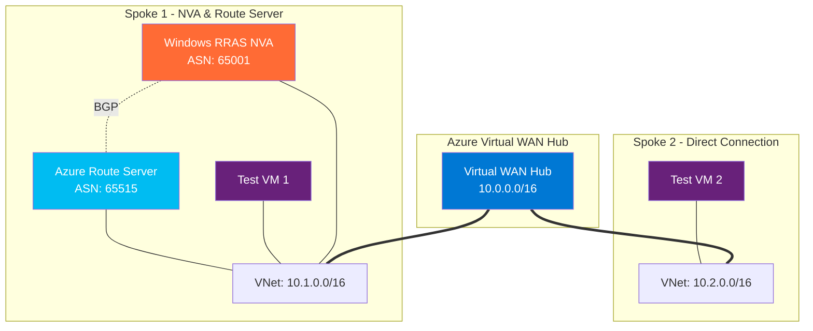

# 🌐 Azure Virtual WAN Lab - Enhanced User Guide

<div align="center">


*A comprehensive lab environment for learning Azure Virtual WAN with BGP routing, Network Virtual Appliances, and Azure Route Server*

**✅ Now with Unified Deployment, Automatic VM Configuration, and Enhanced Security Features!**

</div>

---

## 📋 Table of Contents

- [🎯 What You'll Learn](#-what-youll-learn)
- [🚀 What's New - Unified Deployment System](#-whats-new---unified-deployment-system)
- [🏗️ Lab Architecture](#️-lab-architecture)
- [⚡ Quick Start](#-quick-start)
- [📋 Prerequisites](#-prerequisites)
- [🚀 Step-by-Step Deployment](#-step-by-step-deployment)
- [🔐 Security & Access Features](#-security--access-features)
- [🧪 Testing Your Lab](#-testing-your-lab)
- [🧹 Enhanced Cleanup System](#-enhanced-cleanup-system)
- [🔧 Troubleshooting](#-troubleshooting)
- [💡 Learning Scenarios](#-learning-scenarios)
- [🎯 Advanced Usage](#-advanced-usage)
- [❓ FAQ](#-faq)

---

## 🎯 What You'll Learn

This lab teaches you hands-on experience with:

### 🌟 **Core Technologies**
- **Azure Virtual WAN**: Centralized network connectivity hub
- **BGP Routing**: Dynamic routing protocol for cloud networks
- **Network Virtual Appliances (NVA)**: Custom routing solutions
- **Azure Route Server**: Managed BGP route exchange service
- **Hub-and-Spoke Architecture**: Modern cloud network design

### 🎓 **Skills You'll Gain**
- Deploy enterprise-grade network architectures with automated configuration
- Configure BGP peering between Azure services with RRAS automation
- Implement custom routing with Windows Server RRAS (automatically installed)
- Secure VM access with IP-based NSG rules and Windows Firewall management
- Monitor and troubleshoot complex network topologies with enhanced logging

### 🔐 **Security Skills**
- Configure secure RDP access with deployer IP restrictions
- Implement Azure VM password complexity requirements
- Manage Windows Firewall rules for remote access
- Use automated credential validation and secure handling
- Automate infrastructure deployment with modern DevOps tools
- **NEW**: Manage Azure resources with professional automation tools
- **NEW**: Implement flexible IP addressing schemes
- **NEW**: Use background job management for long-running operations

---

## 🚀 **What's New - Enhanced Features**

### ✅ **Enhanced Deployment System**
- **Flexible Resource Group Management**: Deploy to new RGs while automatically cleaning up old ones
- **IP Schema Selection**: Choose from predefined schemas (default, enterprise, lab) or create custom ranges
- **Background Operations**: Cleanup operations run in background with real-time monitoring
- **Prompt-less Mode**: Fully automated deployments perfect for CI/CD workflows

### ✅ **Professional Resource Management**
- **Standalone Cleanup**: Clean up resources independently of deployment workflows
- **Job Monitoring**: Real-time progress tracking with comprehensive status reporting
- **Bulk Operations**: Manage multiple resource groups simultaneously
- **Error Recovery**: Robust error handling with graceful failure recovery

### ✅ **Developer Experience Improvements**
- **Enhanced VS Code Integration**: One-click deployment and management tasks
- **Comprehensive Documentation**: Step-by-step guides for all skill levels
- **Advanced Troubleshooting**: Automated diagnostic tools and issue resolution
- **Modular Design**: Easy customization and extension capabilities

---

## 🏗️ Lab Architecture

<div align="center">



</div>

### 🏛️ **Architecture Components**

| Component | Purpose | Configuration |
|-----------|---------|---------------|
| **Virtual WAN Hub** | Central connectivity point | `10.0.0.0/16` address space |
| **Spoke VNet 1** | NVA and Route Server demo | `10.1.0.0/16` with BGP routing |
| **Spoke VNet 2** | Direct VWAN connection | `10.2.0.0/16` traditional setup |
| **Windows RRAS NVA** | Custom routing appliance | BGP ASN `65001` |
| **Azure Route Server** | Managed BGP service | BGP ASN `65515` |
| **Test VMs** | Connectivity validation | Windows Server 2022 |

---

## ⚡ Quick Start

> **⏱️ Total Setup Time: ~15 minutes**

### 🎯 **One-Command Deployment**

```powershell
# Clone and deploy in one go!
git clone https://github.com/your-repo/vwanlab.git
cd vwanlab
.\scripts\Deploy-VwanLab.ps1 -ResourceGroupName "rg-vwanlab-demo"
```

### 🔍 **Validate Everything Works**

```powershell
# Run comprehensive connectivity tests
.\scripts\Test-Connectivity.ps1 -ResourceGroupName "rg-vwanlab-demo" -Detailed
```

---

## 📋 Prerequisites

### 🔑 **Required Accounts & Permissions**

- **Azure Subscription** with the following permissions:
  - `Contributor` role (or higher)
  - Ability to create Virtual WAN resources
  - VM creation permissions

### 💻 **Local Environment Setup**

| Tool | Version | Installation |
|------|---------|--------------|
| **PowerShell** | 5.1+ | Pre-installed on Windows |
| **Azure CLI** | Latest | `winget install Microsoft.AzureCLI` |
| **Azure PowerShell** | Latest | `Install-Module Az -Force` |
| **.NET SDK** | 8.0+ | `winget install Microsoft.DotNet.SDK.8` |
| **VS Code** | Latest | `winget install Microsoft.VisualStudioCode` |

### 🛠️ **Automatic Setup**

Run our automated setup script to install everything:

```powershell
# This installs all prerequisites automatically
.\scripts\Install-Prerequisites.ps1
```

---

## 🚀 Step-by-Step Deployment

### **Step 1: Clone the Repository** 📥

```powershell
# Download the lab files
git clone https://github.com/your-repo/azure-vwan-lab.git
cd azure-vwan-lab
```

### **Step 2: Login to Azure** 🔐

```powershell
# Login to Azure (opens browser)
az login

# Verify your subscription
az account show
```

### **Step 3: Create Resource Group** 🏗️

```powershell
# Create a new resource group
az group create --name "rg-vwanlab-demo" --location "East US"
```

### **Step 4: Deploy the Lab** 🚀

Choose your deployment method:

#### **Option A: PowerShell Script (Recommended)**

```powershell
# Deploy using our automated script
.\scripts\Deploy-VwanLab.ps1 -ResourceGroupName "rg-vwanlab-demo"
```

#### **Option B: VS Code Tasks**

1. Open the project in VS Code
2. Press `Ctrl+Shift+P`
3. Type "Tasks: Run Task"
4. Select "Deploy VWAN Lab (PowerShell)"

#### **Option C: Manual Azure CLI**

```powershell
# Deploy using Azure CLI directly
az deployment group create \
  --resource-group "rg-vwanlab-demo" \
  --template-file "bicep/main.bicep" \
  --parameters "@bicep/parameters/lab.bicepparam"
```

### **Step 5: Monitor Deployment** 📊

```powershell
# Watch deployment progress
az deployment group list --resource-group "rg-vwanlab-demo" --output table
```

> **⏳ Deployment Time**: Typically 10-15 minutes

---

## 🧪 Testing Your Lab

### **🔍 Quick Health Check**

```powershell
# Run automated connectivity tests
.\scripts\Test-Connectivity.ps1 -ResourceGroupName "rg-vwanlab-demo"
```

### **📋 Manual Verification Checklist**

| ✅ Check | Resource | Expected Result |
|----------|----------|-----------------|
| **Virtual WAN** | `vwanlab-vwan` | Status: `Succeeded` |
| **VWAN Hub** | `vwanlab-hub` | Routing State: `Provisioned` |
| **Spoke VNets** | Both VNets | Connected to hub |
| **BGP Peering** | Route Server ↔ NVA | Status: `Connected` |
| **VM Connectivity** | Cross-spoke communication | Ping successful |

### **🖥️ Connect to Test VMs**

```powershell
# Get VM connection details
.\scripts\Get-VmConnections.ps1 -ResourceGroupName "rg-vwanlab-demo"
```

### **🌐 Test Cross-VNet Connectivity**

1. **RDP to Test VM 1** (Spoke 1)
2. **Ping Test VM 2** IP address
3. **Verify BGP Routes**:
   ```cmd
   # On the NVA VM
   netsh routing ip show route
   ```

---

## 🔧 Troubleshooting

### **🚨 Common Issues & Quick Fixes**

<details>
<summary><strong>🔴 Deployment Failed</strong></summary>

**Problem**: Template validation or deployment errors

**Solution**:
```powershell
# Run comprehensive troubleshooting
.\scripts\Troubleshoot-VwanLab.ps1 -ResourceGroupName "rg-vwanlab-demo" -FixIssues
```

**Common Causes**:
- Insufficient Azure permissions
- Resource naming conflicts
- Region capacity issues
</details>

<details>
<summary><strong>🟡 BGP Peering Not Working</strong></summary>

**Problem**: Route Server and NVA not exchanging routes

**Solutions**:
1. **Check NVA Configuration**:
   ```powershell
   .\scripts\Configure-NvaVm.ps1 -ResourceGroupName "rg-vwanlab-demo"
   ```

2. **Verify Route Server Status**:
   ```powershell
   az network routeserver show --name "vwanlab-route-server" --resource-group "rg-vwanlab-demo"
   ```
</details>

<details>
<summary><strong>🔵 VM Connectivity Issues</strong></summary>

**Problem**: VMs can't communicate across spokes

**Diagnostic Steps**:
1. **Check NSG Rules**
2. **Verify Route Tables**
3. **Test VM Network Settings**

```powershell
# Run detailed connectivity analysis
.\scripts\Test-Connectivity.ps1 -ResourceGroupName "rg-vwanlab-demo" -Detailed
```
</details>

### **📖 Detailed Troubleshooting**

For comprehensive troubleshooting guidance, see:
- 📚 [Troubleshooting Guide](troubleshooting.md)
- 🛠️ Run: `.\scripts\Troubleshoot-VwanLab.ps1`

---

## 🧹 Cleanup

### **🗑️ Remove All Lab Resources**

#### **Option A: Automated Cleanup**

```powershell
# Remove everything automatically
.\scripts\Cleanup-VwanLab.ps1 -ResourceGroupName "rg-vwanlab-demo"
```

#### **Option B: .NET Automation Tool**

```powershell
# Use the .NET cleanup tool
dotnet run --project src/VwanLabAutomation -- cleanup --resource-group "rg-vwanlab-demo"
```

#### **Option C: Manual Cleanup**

```powershell
# Delete the entire resource group
az group delete --name "rg-vwanlab-demo" --yes --no-wait
```

> **⚠️ Warning**: This permanently deletes all resources. Make sure you've saved any important configurations!

---

## 💡 Learning Scenarios

### **🎓 Scenario 1: Basic VWAN Connectivity**

**Goal**: Understand hub-and-spoke network architecture

**Steps**:
1. Deploy the lab environment
2. Examine VWAN hub connections
3. Test VM-to-VM connectivity
4. Review Azure portal network topology

### **🎓 Scenario 2: BGP Route Exchange**

**Goal**: Learn dynamic routing with BGP

**Steps**:
1. Connect to the NVA VM
2. Examine BGP configuration in RRAS
3. Monitor route advertisements
4. Test route propagation

### **🎓 Scenario 3: Custom Routing Policies**

**Goal**: Implement advanced routing scenarios

**Steps**:
1. Modify NVA routing configuration
2. Create custom route filters
3. Test traffic steering
4. Analyze routing tables

### **🎓 Scenario 4: High Availability**

**Goal**: Design resilient network architectures

**Steps**:
1. Add second NVA for redundancy
2. Configure BGP load balancing
3. Test failover scenarios
4. Monitor route convergence

---

## ❓ FAQ

<details>
<summary><strong>🤔 What Azure resources will be created?</strong></summary>

The lab creates approximately **22 Azure resources**:
- 1 Virtual WAN
- 1 Virtual WAN Hub
- 2 Virtual Networks
- 3 Virtual Machines
- 1 Azure Route Server
- Multiple network interfaces, disks, and security groups
- Supporting resources (public IPs, route tables, etc.)
</details>

<details>
<summary><strong>💰 How much will this lab cost?</strong></summary>

**Estimated daily cost**: $20-40 USD (varies by region)

**Cost breakdown**:
- Virtual WAN Hub: ~$15/day
- VMs (3x Standard_D2s_v3): ~$20/day
- Route Server: ~$3/day
- Other resources: ~$2/day

**💡 Cost-saving tips**:
- Deallocate VMs when not in use
- Use smaller VM sizes for learning
- Clean up resources after labs
</details>

<details>
<summary><strong>⏱️ How long does deployment take?</strong></summary>

**Typical deployment times**:
- Template validation: 2-3 minutes
- Resource creation: 10-15 minutes
- NVA configuration: 3-5 minutes
- **Total**: 15-20 minutes
</details>

<details>
<summary><strong>🌍 Which Azure regions are supported?</strong></summary>

**Recommended regions** (best VWAN support):
- East US
- West US 2
- West Europe
- Southeast Asia

**Requirements**:
- Virtual WAN availability
- Azure Route Server support
- Sufficient compute quota
</details>

<details>
<summary><strong>🔧 Can I customize the lab configuration?</strong></summary>

**Yes!** The lab is highly customizable:

- **Network addresses**: Edit `bicep/parameters/lab.bicepparam`
- **VM sizes**: Modify `vmSize` parameter
- **Regions**: Change `primaryRegion` parameter
- **Names**: Adjust `environmentPrefix` parameter

**Example customization**:
```json
{
  "environmentPrefix": "mycompany",
  "primaryRegion": "West US 2",
  "vmSize": "Standard_B2s"
}
```
</details>

<details>
<summary><strong>🛡️ Is this lab production-ready?</strong></summary>

**This is a learning lab**, not production infrastructure:

**✅ Good for**:
- Learning VWAN concepts
- Testing BGP configurations
- Understanding Azure networking
- Proof-of-concept deployments

**❌ Not production-ready**:
- No high availability
- Basic security configuration
- Limited monitoring
- No backup/disaster recovery
</details>

---

## 🎉 Next Steps

Congratulations on completing the Azure Virtual WAN lab setup! Here are some ways to continue your learning journey:

### 📚 **Advanced Learning**
- [Azure Architecture Center](https://docs.microsoft.com/azure/architecture/)
- [Azure Virtual WAN Documentation](https://docs.microsoft.com/azure/virtual-wan/)
- [BGP Best Practices](https://docs.microsoft.com/azure/route-server/route-server-faq)

### 🛠️ **Extend the Lab**
- Add ExpressRoute connectivity
- Implement Azure Firewall
- Configure site-to-site VPN
- Set up monitoring with Azure Monitor

### 🤝 **Community**
- Share your experience
- Report issues or improvements
- Contribute to the project
- Help others learn

---

<div align="center">

**Happy Learning! 🚀**

*Made with ❤️ for the Azure community*


</div>
